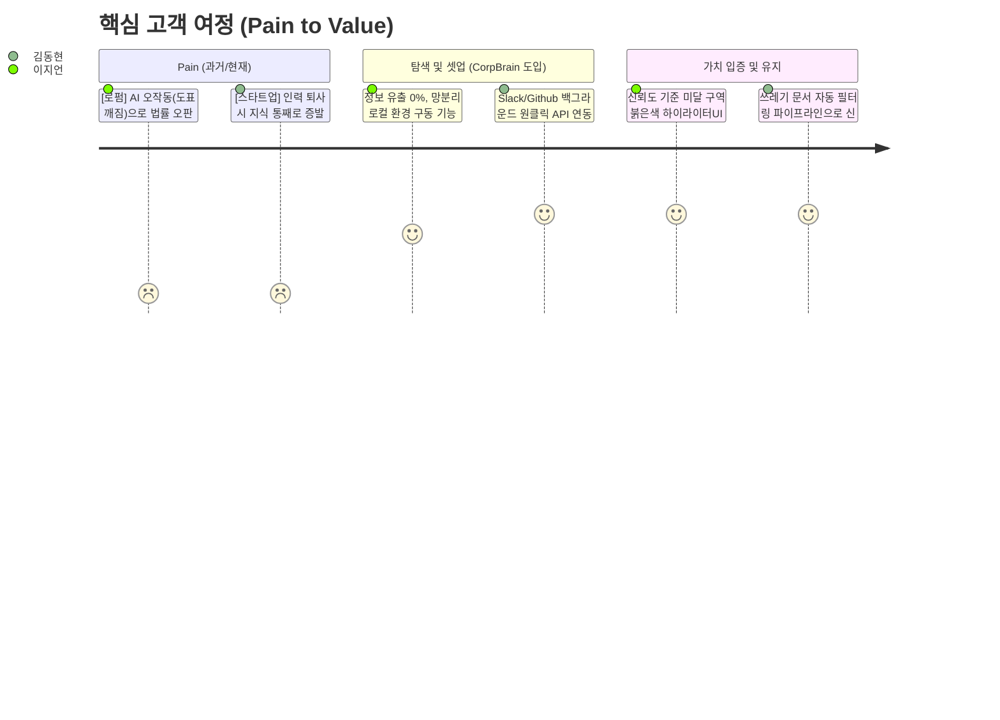
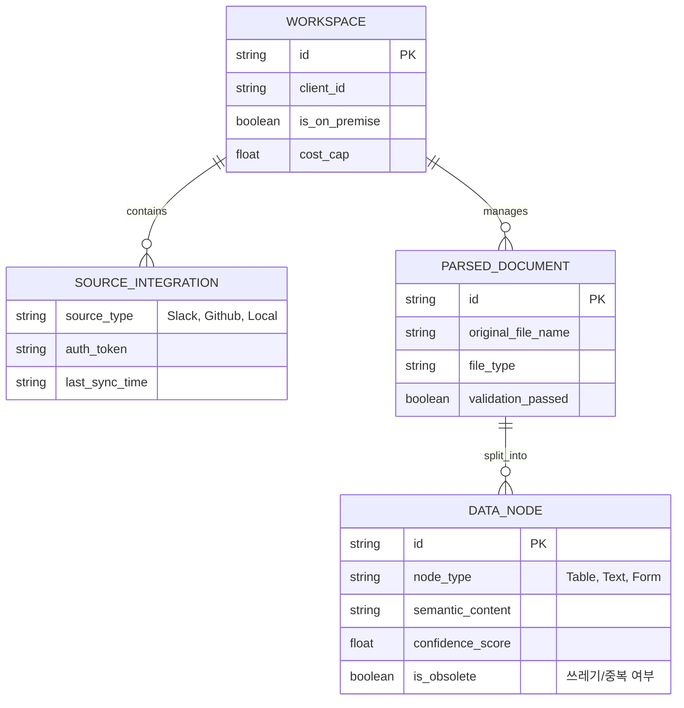

# CorpBrain (SME용 실시간 데이터 클리닝 OS) PRD v0.5
- Owner 팀: 다온 & 회비서
- 최종 업데이트: 2026-04-22

## 1. 개요·목표

- **문제 정의(Pain지표 포함)**:
  - **[Pain 1 - 부티크 로펌]** 복잡한 법률 서식(도표)의 파싱 붕괴 및 환각 발생.
    - *실패 KPI*: "문서 파싱 후 수작업 검수 및 대조 시간 일 4시간 초과 건수 비중 80% 이상", "데이터 추출/표기 오류율 5% 초과".
  - **[Pain 2 - 기술 스타트업]** 핵심 인력 퇴사로 인한 레거시 데이터 블랙박스화 및 분절된 환경.
    - *실패 KPI*: "신규 입사자 시스템 지식 인수인계 및 온보딩 소요 시간 2주 이상 비율 70%", "기존 사일로 앱 데이터 중복으로 인한 RAG 환각 사고 발생률 15% 초과".

- **목표(Desired Outcome 수치화)**:
  - 사용자의 수작업 문서 검수 시간 극단적 단축 (**일 4h → 30min 이내**, 87.5% ↓).
  - 표/특수 양식 환각 및 문서 오표기 **0건(0%)** 달성.
  - 신규 인력 온보딩 및 문서 최신화 세팅 소요 시간 **Days 단위에서 Hours 단위로 감축** (85% ↓).
  - 외부 API/클라우드 의존성 0%, 100% 로컬 LLM 구동을 통한 **사내망/망분리 완전 준수(데이터 유출 원천 차단)**.

- **성공 지표(북극성/보조 KPI)**:
  - **북극성 KPI**: 무결점 포맷 보존 파싱 성공률 
    - 기준/목표: Baseline 85% → Target 99.9%
    - **측정 주기 및 경로**: 매주 금요일 / 내부 자동화 검증 스크립트를 통한 샘플 벤치마크 세트(n=100) F1-Score 계산 및 ElasticSearch 파싱 실패 로그 쿼리 집계.
  - **보조 KPI 1**: 고객당 평균 수작업 대조 체류 시간
    - 기준/목표: Baseline 4시간/일 → Target 30분 미만/일
    - **측정 주기 및 경로**: 월간 / 클라이언트 뷰어 페이지 내 문서별 체류 시간(Session Duration) 및 셀 구조 수동 덮어쓰기 이벤트 클릭 추적 (Amplitude/Mixpanel 연동).
  - **보조 KPI 2**: 쓰레기/구버전 문서 자동 필터링률
    - 기준/목표: Baseline 0% → Target 90% 이상 차단
    - **측정 주기 및 경로**: 주간 / 전체 Ingestion Source API 진입 건수 대비 Semantic Dedup 모듈에 의해 Drop(배제)된 로그 건수의 비율 산출.
  - **보조 KPI 3**: 도입 후 첫 파트너 툴 동기화 온보딩 소요 시간
    - 기준/목표: Target 1시간 이내
    - **측정 주기 및 경로**: 건별 처리 즉시 / SaaS 계정 생성 시점값과 최초 파이프라인 동기화 `HTTP 200 OK` 수신 시점 간의 타임스탬프 델타(Delta) 추출.

---

## 2. 사용자와 페르소나

- **핵심 페르소나 요약**:
  1. **이지언 (부티크 특화 로펌 대표 / 코어 1)**
     - Pain & Needs: 범용 문서 파서의 한계로 도표가 깨지면서 실사 보고서 작성 시 패소 등 법률적 위기 초래. 100% 로컬 보안 환경 내에서 표/특수 양식을 정밀 파싱하고, 인간에게 오류 가능 구역을 알려주는 기능이 시급함.
  2. **김동현 (시리즈 B 기술 스타트업 CTO / 코어 2)**
     - Pain & Needs: 핵심 기술 인력 퇴사 이후 Slack/Github 등에 파편화된 지식이 유실되어 조직 스프린트가 망가짐. 기존 툴 구조를 그대로 두면서 구버전을 솎아내고 살아있는 최신 지식만 파이프라인으로 연결하길 원함.

---

## 3. 사용자 스토리와 수용 기준(AC, Acceptance Criteria)

### **Story 1: 법률적 리스크를 통제해야 하는 전문직 집단**
> **Story**: As a 부티크 로펌 파트너(이지언), I want 도표/특수양식을 100% 복원하여 파싱하고 불안해하는 저신뢰도 구간을 하이라이트 표시해주길 원한다, so that 내가 에러 색출 및 수기 대조에 쏟는 일일 업무 시간을 4시간에서 30분 이내로 줄일 수 있다.

- **AC 1 (무결점 표 추출):** Given 로펌 특화 양식(표, 문서 주석 포함)이 업로드되었을 때, When 로컬 클리닝 엔진이 파싱을 완료하면, Then 표 셀 병합과 경계선이 **TEDS-Struct Score 기준 99.9점 이상을 달성하며 정형 데이터 포맷(CSV/XML/Markdown)으로 추출**되어야 한다.
- **AC 2 (Confidence 하이라이터):** Given 추출된 결과물을 변호사가 검수 플랫폼에서 열람했을 때, When AI 파싱 확신도(Confidence Score) 판별 기준이 **80% 미만인 데이터가 감지되면**, Then 해당 영역을 **0.5초 이내에 붉은색으로 하이라이트 렌더링**하여 인간의 검수 지연을 최소화해야 한다.
- **AC 3 (망분리 사수):** Given 고객사가 완전 폐쇄망(Local On-premise) 설치를 요구할 때, When 문서 파싱 및 렌더링을 완전히 마쳤을 때, Then 외부 클라우드로 전송되는 **아웃바운드 통신(트래픽) 볼륨이 정확히 0 Byte**여야 한다.
- **AC 4 (실패/예외 방어 - 손상 문서 및 인식 불가):** Given 비밀번호가 걸려 있거나 해상도가 50dpi 미만인 물리적 손상/난독 문서가 업로드되었을 때, When 클리닝 엔진이 파싱을 시도하여 10초 이내에 정상 구조화가 불가능함을 판별하면, Then 무한 루프 추론 시도를 즉시 멈추고 "보안 해제 및 원본 해상도 상향 요망"이라는 구체적 오류 코드를 반환한 뒤 **프로세스 종료 직후 할당된 메모리 반환율 100%를 보장하며 안전 종료(Graceful shutdown)** 해야 한다.

### **Story 2: 파편화 지식을 방어해야 하는 기술 조직**
> **Story**: As a 기술 스타트업 CTO(김동현), I want 기존 Slack/Github를 그대로 연동한 채로 백그라운드 엔진이 쓰레기 문서를 걸러주길 원한다, so that 개발자들의 툴 전환 마찰 없이도 퇴사자 지식 블랙박스를 걷어내 신입사원을 단기간에 온보딩시킬 수 있다.

- **AC 1 (무마찰 연동 속도):** Given 사용자가 사용 중인 기존 도구(Slack, Notion 등) 환경에서, When CorpBrain 커넥터 연동 버튼을 클릭하면, Then **5분 이내에 증분 동기화 셋업이 백그라운드 가동**되며 사용자의 UI 워크플로우를 전혀 변경하지 않아도 받아들여져야 한다.
- **AC 2 (쓰레기 필터링 효율):** Given 파편화된 과거 명세서 더미가 수집 엔진에 들어올 때, When Semantic Dedup(의미 기반 중복 제거)을 거치면, Then **기존 벡터 데이터와 Cosine Similarity 0.85 이상인 중복 문건의 90% 이상이 자동 블록/배제**되고 최신 자산만 남아야 한다.
- **AC 3 (API 과금 캡 제어):** Given 실시간 API 동기화가 동작 중일 때, When 새로운 변경점(증분 코스트)을 읽어 들일 때, Then 사용자 설정 월 API 토큰 상한액(Cost Cap)을 초과하는 콜이 발생할 경우 **즉시 100% 호출을 중단하고 경고 알림**을 띄워야 한다.
- **AC 4 (실패/예외 방어 - 스코프 권한 충돌 및 타임아웃):** Given 연동 완료된 Slack/Github의 API 토큰이 권한 축소 권고나 만료로 인해 Invalid 되었을 때, When 월간 백그라운드 증분 수집 요청 시 `401 Unauthorized` 패킷을 반환받으면, Then 고객사 계정 담당자에게 즉시 "토큰 갱신 필요 알림"을 이메일로 3분 내 발송하고 해당 프로세스 노드를 휴면(Suspend) 모드로 전환해야 한다.

---

## 4. 기능 요구사항(Functional)

| MSCW 우선순위 | 기능명 | 기능 요약 및 차별 가치 | 의존성(Dependency) |
| :--- | :--- | :--- | :--- |
| **Must Have** | **무결점 Table & Form Parser (P1)** | 기존 대안 클라우드 OCR API 대비 벤치마크 테스트 상 **'표 내 요소 변위 에러율(Cell displacement rate)'이 10% 이하임(90% 감소)을 보장**할 것. 로컬 구동 시 Opex(운영비) 측면에서 종량제 API 콜 대비 사용 1주기(1년) 내 **비용 구조 80% 우위** 보장.  👉 **Agile Lock-in (첫 스프린트 스펙 축소)**: V0.2 첫 스프린트는 전체 법무 서식이 아닌 **'A 법무법인의 하도급 표준 계약서 1종' 파싱 성공에만 리소스를 100% 집중하여 1주 내 PoC 버전을 릴리즈**한다. | - |
| **Must Have** | **Confidence Score 에러 하이라이터 UI (P2)** | 의심 데이터(80점 미만)를 붉은색 시각 기호로 통제해, 인간의 전수 대조 시간(대안) 대비 **검수 시간을 87.5% 가속**하고 심리적 안정성 확보. | **P1(엔진 스키마 결과물)에 후행 의존** |
| **Should Have** | **가비지 선별(Semantic Dedup) (P3)** | 무분별한 저장소 Ingestion을 수행하는 범용 RAG 대안 대비, 로컬 임베딩 모델을 활용해 파이프라인에서 중복을 사전 차단하여 **스토리지 유지비 및 후속 RAG 연산 부하를 최소 60% 이상 절감**함 증명. | P1 결과 데이터에 일부 의존 |
| **Should Have** | **단일 클릭 백그라운드 커넥터** | 직접 스크립트 연결 시 소요 시간 7일(대안) 대비 **단 5분(99% 감소) 이내 세팅**하며 툴 전환율 저항 0%. | - |
| **Could Have** | **PII 오토 마스킹 컴플라이언스 (P4)** | KISA 가이드라인 기준 **주민등록번호/기밀 데이터 자동 탐지율 99% 이상을 보장**하고 **문서당 마스킹 처리 지연을 100ms 이하로 통제**하여, 망분리 규제 돌파 및 B2B 세일즈 마찰을 제거함. | **P1(결과 블록 처리 모듈)에 의존** |
| **Won't Have** | **범용 음성/이미지 획득 모듈** | 공장장, 제조업 등 타이핑 불가 직무를 위한 음성/OCR 사진 로직 배제하여 현재의 공략 구간 비용 집중. | - |

---

## 5. 비기능 요구사항(NFR, Non-Functional Requirement)

- **성능**: 
  - p95 응답 기준: 문서 장당 파싱 완료 소요 시간 **≤ 1,500 ms** (※ 단, A4 1장/300dpi/일반 텍스트 및 표 혼합 기준이며, 50MB에 육박하는 고용량 스캔본이나 복잡도가 극단적인 도면/설계서 등은 용량 및 해상도에 비례해 처리 시간이 증가함을 전제함)
  - 배치 파싱 시 증분 데이터(Delta) 수집 동기화 지연 **≤ 3 minutes**
- **신뢰성**: 
  - 클리닝 파서 시스템 월간 가용성 **≥ 99.9%** 유지
  - 추출 과정(Parser Error Rate) 중 엔진 크래시 및 오류율 **≤ 0.1%** 통제
- **보안/비용**:
  - **[100% 온프레미스/로컬 LLM 아키텍처]**: 데이터는 어떤 경우에도 외부 클라우드나 상용 LLM API로 전송되지 않으며, 사내 폐쇄망에 구축된 로컬 LLM(sLLM 기반) 및 파서 엔진으로만 구동되어 데이터 주권을 완벽히 보장. (클라우드/Hybrid 배포 모델 전면 배제)
  - 고객사가 지정한 PII(민감 정보)는 로컬 엔진 내에서도 **AES-256 알고리즘을 적용한 오토 마스킹/암호화를 문서당 100ms 이내에 처리**하여 추가적인 이중 보안을 적용.
  - 고객별 월 토큰 제한값 설정 기능 제공, 해당 토큰 초과 컷오프(Cut-off) 구현 탑재.
- **모니터링 항목 및 경고/알림 임계치 스펙 (Monitoring & Alert Limits)**:
  - **[서버 & 메모리 보호 (Error/OOM)]** 파싱 처리 중 메모리 누수로 사용률 **1.5GB 한도 수치를 위협(90% 도달)** 하거나 엔진 크래시가 주당 **3회** 이상 발생 시 즉시 PagerDuty/Slack P1 채널로 1분 내 경보 발송.
  - **[서비스 상태 대시보드 (Timeout)]** 시스템 문서 전처리 중 타임아웃(**2,000ms 지속 초과**) 및 Confidence 80점 미만 하이라이터 발생 비중이 전체 처리량의 **5% 이상 단기 쏠림점** 도달 시 관리자 관제 대시보드에 적색 경고 알럿(Popup) 등재.
  - **[비용/API Rate Limit 제어]** 플랫폼 내 월간 토큰 제한치 대비 소모 잔여율이 **15% 이하** 진입 시 1차 계정자 경고 알림 전송. 토큰 0% 소진 도달 시 시스템 강제 Ingestion 컷오프 조치하고 `HTTP 429 Too Many Requests` 상태를 응답할 것.

---

## 6. 데이터·인터페이스 개요

### 핵심 엔터티 (Entities)

### 외부/내부 API 개요 (입출력·제약)
- **외부 Connector API (Ingestion)**:
  - 연동 방식: 웹훅(Webhook) 우선 채택, Polling 시 증분(Incremental) ID 기반 제한적 호출.
  - 제약: 타사 OAuth 토큰 순환 리프레시 보안 유지, API Rate Limit 최적 우회.
- **내부 Engine API (Parsing & Cleaning)**: 
  - `POST /api/v1/clean` 
    - Input: 업로드 파일 바이너리 (최대 50MB 제한) + 스키마 템플릿 메타.
    - Output: 구조화된 JSON 데이터 배열 + {`highlight_ranges`, `confidence_metrics`}.
- **Export API (Outbound)**: 
  - 지원 포맷: 통합 JSON, CSV, 표준 XML 덤프, 혹은 기존 사용 중인 범용 RAG Vector DB용 구조화 Payload 전송.

---

## 7. 범위(In/Out), 리스크·가정·의존성

- **In / Out 명시**
  - **IN Scope**: SME용 로컬 폐쇄망 파서 엔진 구현, 구버전 필터 판단 로직(Semantic Dedup), 저신뢰도 하이라이터 UI 제공, Slack/Github 커넥터 제공.
  - **OUT of Scope**: 비정형 문서를 새로 자동 기안/생성하는 에이전트, 화려하고 복잡한 프론트엔드 자체 채팅뷰어(RAG 봇 자체 제작보다 후방 데이터 클리닝 배관에 집중), 단독 SI 수주 기반 맞춤 개발 제공.

- **핵심 리스크 및 완화 플랜 (최소 3개)**
  1. *[경쟁리스크]* 오픈소스 파서 API 단가 하방 압력 평준화.
     - **대응 방안**: 단순 인식/변환 외에 "비즈니스 컨설팅 수준의 폴더 자동 재구성 및 의미 단위 솎아내기 역량(Dedup)" 기능 고도화에 개발 집중.
  2. *[기술리스크]* 특수 양식 템플릿이 특정 로펌별로 예외 케이스(Edge case)가 터질 우려.
     - **대응 방안**: 탑 티어 로펌이 쓰는 표준 계약서 템플릿 10여 가지를 사전 학습시켜 Rule-based + 로컬 LLM(sLLM) 앙상블 패턴으로 폐쇄망 내에서 정확도를 영구 방어.
  3. *[비즈니스]* 인프라 설치 요구로 인한 On-premise 영업 마찰 및 세팅 시간 오버헤드.
     - **대응 방안**: 인프라 종속성을 끊는 완전한 컨테이너(Docker/K8s) 형태로 플러그앤플레이(Plug & Play) 제공 (ADR-001 인프라 정책 참조 요망).

- **가정·의존성**
  - 고객사 내 별도의 숙련된 파이썬/플랫폼 엔지니어가 개입하지 않아도 시스템 UI로 초기 세팅이 종결된다고 가정함.
  - [ADR-002: LlamaParse 등 강력한 오픈소스 생태계 종속 피하기 플러거블 패턴 채택 링크 연계를 상정]

---

## 8. 실험·롤아웃·측정

- **베타 채널 (PoC 가동 타겟)**: 
  - 거점(SOM) 시장인 "부티크 로펌 3개 파트너스" 및 "시리즈 B급 R&D 스타트업 5개사" 대상 밀착 Closed Beta 운영 (2~4주).

- **경쟁 대안 벤치마크 (정량적 벤치마크 기준점 부여)**:
  - 검증 환경: 1,000건의 특수 얼룩 표본 세트(Dirty Form Dataset) 투입 시뮬레이션
  - 측정 도구 일원화: 자동 표 인식 평가지표(**TEDS-Struct 점수: Tree-Edit-Distance-based Metric**) 및 F1-Score 동시 측정.
  - 통과 기준 임계치: 외부 타사 A API 결과 모델보다 CorpBrain TEDS-Struct 점수가 **+25pt(또는 해당 오차율 상위 25%) 우위**에 있음을 데이터로 증명 시 MVP 메인 엔진 릴리즈 조건 달성 심사 통과.

- **실험 가설 및 측정 계획**:
  1. **[로펌] AI 확신도 UI 전환 효율 극대화 가설** 
     - 가설: "Confidence 80 미만 붉은색 하이라이터 UI를 부여하면, 인간 변호사의 검수 전환 완료율 스트레스가 소멸하고, 검수 소요 시간이 경쟁 툴 대비 3배 이상 빠를 것이다."
     - 측정 지표(Metrics): 평균 문서당 UI 검수 승인완료까지 클릭 시간 추적 (로그), 만족도 평가 5점 척도.
     - 성공 기준: 처리 시간 80% 감소 + 만족도 평균 4.5 초과.
  2. **[스타트업] 쓰레기 분리 RAG 파이프라인 신뢰 방어 가설**
     - 가설: "사내 Slack 원클릭 커넥터 동기화 후, Semantic Dedup으로 문서를 걸러냈을 때 기존 통합 RAG보다 환각 팩트체크 실패율이 유의미하게 감소할 것이다."
     - 측정 지표(Metrics): A/B 모델 테스트 (기존 툴 RAG vs CorpBrain 클리닝 엔진 후속 RAG의 정답률). 
     - 성공 기준: **사전 정의된 검증용 정답셋(Ground Truth) 100문항 기반 응답 일치율(Hit Rate) 95% 이상 유지** (오참조 5% 미만 유지).

---

## 9. 근거(Proof) 및 Validation 연계

- **검증 소스 1**: 가상 인터뷰 덤프 (이지언 변호사 발언)
  - _"붉은색 표시만 리뷰하면 심리적 방어선 구축되어 즉시 도입함."_
  - 연계 사항: 이 발언은 본 문서 **[Section 1]의 '검수 체류시간(4h→30min) 단축 보조 KPI'** 및 **[Section 3] 'AC 2 하이라이터'**의 프로덕트 구현 적합성을 정당화하는 논리적 스폰서 역할을 합니다. 도입 후 해당 체류 수치가 달성되면 이 사용자의 문제를 완벽히 해결한 것으로 간주(Validated)합니다.
- **검증 소스 2**: 가상 인터뷰 덤프 (김동현 CTO 발언)
  - _"과거 중복 기록 필터링 및 마찰 없는 백그라운드 연동 시 전사 풀계정 결제."_
  - 연계 사항: 본 발언은 개발팀이 무리하고 화려한 뷰어 플랫폼을 짜기보다, 백그라운드의 **[Section 4] 가비지 선별(Semantic Dedup)** API 구축에 리소스를 조기 투입하도록 강제하는 Proof 데이터입니다. 온보딩 1시간 이내(보조 KPI 3) 성공 시 시장 PMF 관문 통과로 간주합니다.
