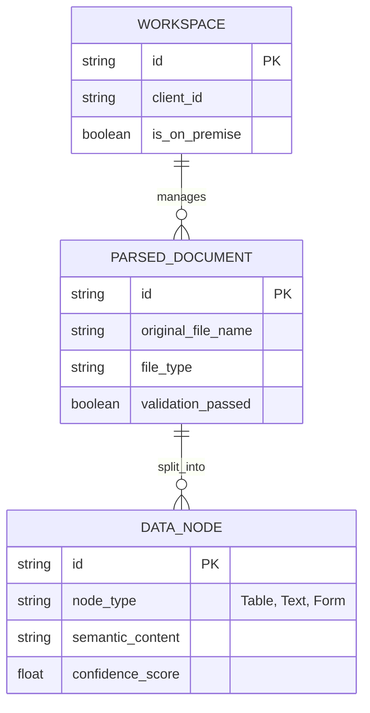

# CorpBrain (SME용 실시간 데이터 클리닝 OS) PRD v0.6 (Lean MVP)
- Owner 팀: 다온 & 회비서
- 최종 업데이트: 2026-04-23
- **v0.6 개정 목표**: MVP 출시 리스크 최소화를 위한 과감한 스펙 다이어트 (K8s, 커넥터, Dedup 제외)

## 1. 개요·목표

- **문제 정의(Pain지표 포함)**:
  - **[Pain 1 - 부티크 로펌]** 복잡한 법률 서식(도표)의 파싱 붕괴 및 환각 발생.
    - *실패 KPI*: "문서 파싱 후 수작업 검수 및 대조 시간 일 4시간 초과 건수 비중 80% 이상", "데이터 추출/표기 오류율 5% 초과".

- **목표(Desired Outcome 수치화)**:
  - 사용자의 수작업 문서 검수 시간 극단적 단축 (**일 4h → 30min 이내**, 87.5% ↓).
  - 표/특수 양식 환각 및 문서 오표기 **0건(0%)** 달성.
  - 외부 API/클라우드 의존성 0%, 100% 로컬 LLM 구동을 통한 **사내망/망분리 완전 준수(데이터 유출 원천 차단)**.

- **성공 지표(북극성/보조 KPI)**:
  - **북극성 KPI**: 무결점 포맷 보존 파싱 성공률 
    - 기준/목표: Baseline 85% → Target 99.9%
  - **보조 KPI 1**: 고객당 평균 수작업 대조 체류 시간
    - 기준/목표: Baseline 4시간/일 → Target 30분 미만/일

---

## 2. 사용자와 페르소나

- **핵심 페르소나 요약**:
  1. **이지언 (부티크 특화 로펌 대표 / 코어 1)**
     - Pain & Needs: 범용 문서 파서의 한계로 도표가 깨지면서 실사 보고서 작성 시 패소 등 법률적 위기 초래. 100% 로컬 보안 환경 내에서 표/특수 양식을 정밀 파싱하고, 인간에게 오류 가능 구역을 알려주는 기능이 시급함.
  
  *(※ v0.6 Lean MVP에서는 김동현 CTO(스타트업)의 자동화 및 필터링 페르소나 검증은 V0.7 이후로 연기합니다.)*

---

## 3. 사용자 스토리와 수용 기준(AC, Acceptance Criteria)

### **Story 1: 법률적 리스크를 통제해야 하는 전문직 집단**
> **Story**: As a 부티크 로펌 파트너(이지언), I want 도표/특수양식을 100% 복원하여 파싱하고 불안해하는 저신뢰도 구간을 하이라이트 표시해주길 원한다, so that 내가 에러 색출 및 수기 대조에 쏟는 일일 업무 시간을 4시간에서 30분 이내로 줄일 수 있다.

- **AC 1 (무결점 표 추출):** Given 로펌 특화 양식(표, 문서 주석 포함)이 업로드되었을 때, When 로컬 클리닝 엔진이 파싱을 완료하면, Then 표 셀 병합과 경계선이 **TEDS-Struct Score 기준 99.9점 이상을 달성하며 정형 데이터 포맷(CSV/XML/Markdown)으로 추출**되어야 한다.
- **AC 2 (Confidence 하이라이터):** Given 추출된 결과물을 변호사가 검수 플랫폼에서 열람했을 때, When AI 파싱 확신도(Confidence Score) 판별 기준이 **80% 미만인 데이터가 감지되면**, Then 해당 영역을 **0.5초 이내에 붉은색으로 하이라이트 렌더링**하여 인간의 검수 지연을 최소화해야 한다.
- **AC 3 (망분리 사수):** Given 고객사가 완전 폐쇄망(Local On-premise) 설치를 요구할 때, When 문서 파싱 및 렌더링을 완전히 마쳤을 때, Then 외부 클라우드로 전송되는 **아웃바운드 통신(트래픽) 볼륨이 정확히 0 Byte**여야 한다.
- **AC 4 (실패/예외 방어):** Given 손상 문서가 업로드되었을 때, When 클리닝 엔진이 파싱을 시도하여 10초 이내에 정상 구조화가 불가능함을 판별하면, Then 즉시 프로세스를 안전 종료(Graceful shutdown)하고 메모리를 100% 반환해야 한다.

---

## 4. 기능 요구사항(Functional)

| MSCW 우선순위 | 기능명 | 기능 요약 및 차별 가치 | 의존성(Dependency) |
| :--- | :--- | :--- | :--- |
| **Must Have** | **무결점 Table & Form Parser (P1)** | 기존 대안 클라우드 OCR API 대비 벤치마크 테스트 상 **'표 내 요소 변위 에러율'이 10% 이하임(90% 감소)을 보장**할 것.  👉 **Agile Lock-in (첫 스프린트 스펙 축소)**: V0.2 첫 스프린트는 **'A 법무법인의 하도급 표준 계약서 1종' 수동 업로드 파싱 성공에만 리소스를 100% 집중**하여 1주 내 PoC 버전을 릴리즈한다. | - |
| **Must Have** | **Confidence Score 에러 하이라이터 UI (P2)** | 의심 데이터(80점 미만)를 붉은색 시각 기호로 통제해, **검수 시간을 87.5% 가속**하고 심리적 안정성 확보. | P1에 후행 의존 |
| **Could Have** | **PII 오토 마스킹 컴플라이언스 (P3)** | KISA 가이드라인 기준 자동 탐지 및 마스킹 처리. (MVP에서는 필수 기능 검증 후 리소스 여유 시 개발) | P1에 의존 |
| **Won't Have** | **가비지 선별(Semantic Dedup)** | MVP 단계 오버엔지니어링(벡터 기반 코사인 유사도 연산 등 복잡도 증가) 회피를 위해 V0.7 이후로 연기. | - |
| **Won't Have** | **단일 클릭 백그라운드 커넥터** | 3사(Slack/Github/Notion) API 인증 및 만료 관리 등 인프라 공수 방지를 위해 **수동 파일 업로드**로 대체. V0.7 이후 연기. | - |

---

## 5. 비기능 요구사항(NFR, Non-Functional Requirement)

- **성능**: 
  - p95 응답 기준: 문서 장당 파싱 완료 소요 시간 **≤ 1,500 ms**
  - 하이라이터 UI 렌더링 응답 시간 **≤ 0.5초**
- **인프라 및 배포 (초단기 MVP 기준)**:
  - 복잡한 K8s 클러스터링을 **제외**하고, 고객사의 단일 서버(로컬)에서 구동 가능한 **단일 Docker Compose** 수준의 패키징으로 배포 구조를 극도로 단순화.
- **보안**:
  - **[100% 온프레미스/로컬 LLM 아키텍처]**: 데이터 외부 전송 0 Byte 원칙 고수.
- **모니터링 (오버엔지니어링 제거)**:
  - *기존 PagerDuty 연동 및 실시간 Alert 자동화는 삭제*. 대신 엔진 크래시 및 OOM 발생 시 단일 로컬 로그 파일에 오류 코드를 남기고, 프로세스가 즉각 재시작되도록(Docker restart_policy) 조치하여 개발 난이도를 낮춤.

---

## 6. 데이터·인터페이스 개요 (MVP 중심)

### 핵심 엔터티 (Entities)
MVP 스펙에 맞추어 `SOURCE_INTEGRATION` 및 벡터 필드 삭제.

### 내부 API 개요
- **Engine API (Parsing & Cleaning)**: 
  - `POST /api/v1/clean` (Input: 바이너리 업로드 / Output: JSON + `highlight_ranges`)
- **Export API (Outbound)**: 
  - `GET /api/v1/export` (JSON/CSV 포맷 다운로드)

---

## 7. 범위(In/Out), 리스크·가정·의존성

- **In / Out 명시**
  - **IN Scope**: 로컬 폐쇄망 파서 엔진, 수동 파일 업로드 인터페이스, 저신뢰도 하이라이터 UI, CSV/JSON 내보내기.
  - **OUT of Scope**: **Slack/Github 등 타사 API 연동, 로컬 임베딩 기반 Semantic Dedup, K8s 기반 오토 스케일링 배포망, 외부 경보 발송 시스템(PagerDuty 등)**.

- **핵심 리스크 대응**
  - *[기술리스크]* 특수 양식 템플릿의 로펌별 예외 케이스 우려.
    - **대응 방안**: MVP 단계에서는 오직 **'A 법무법인 하도급 표준 계약서 1종'**에만 맞춤화하여 Rule-based + 로컬 sLLM 방식을 검증하고, 성공 시 템플릿을 수평 확장함.

---

## 8. 실험·롤아웃·측정

- **베타 채널 (PoC 가동 타겟)**: 
  - "부티크 로펌 파트너스" (A 법무법인 단일 타겟)
- **실험 가설 및 측정 계획**:
  1. **AI 확신도 UI 전환 효율 극대화 가설** 
     - 가설: "Confidence 80 미만 붉은색 하이라이터 UI를 부여하면, 인간 변호사의 검수 소요 시간이 기존 수작업 대비 80% 이상 단축될 것이다."
     - 측정 지표(Metrics): 평균 문서당 UI 검수 승인완료(validation_passed=true)까지 체류 시간 추적.
     - 성공 기준: 처리 시간 80% 감소 + 파싱 붕괴 0건.

---
*— End of Lean MVP Document —*
