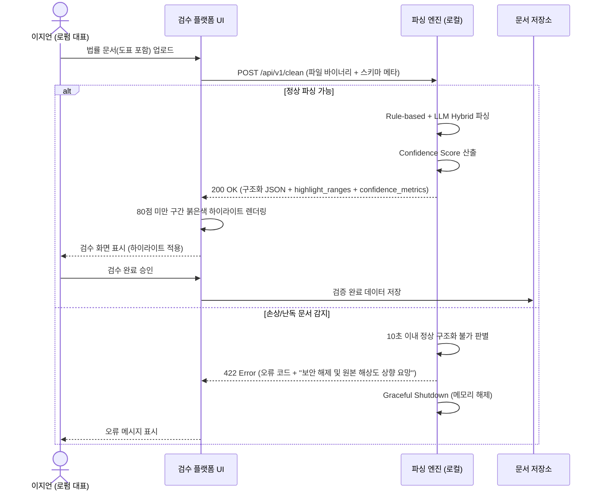
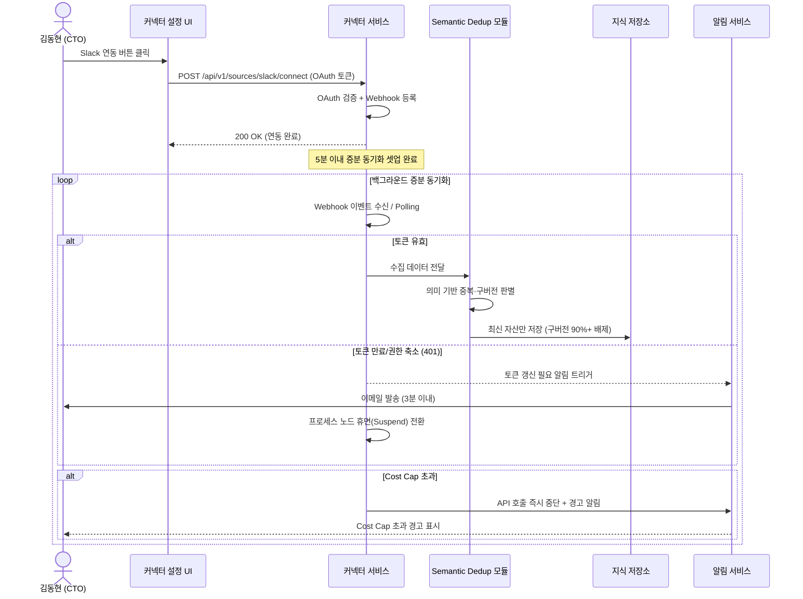
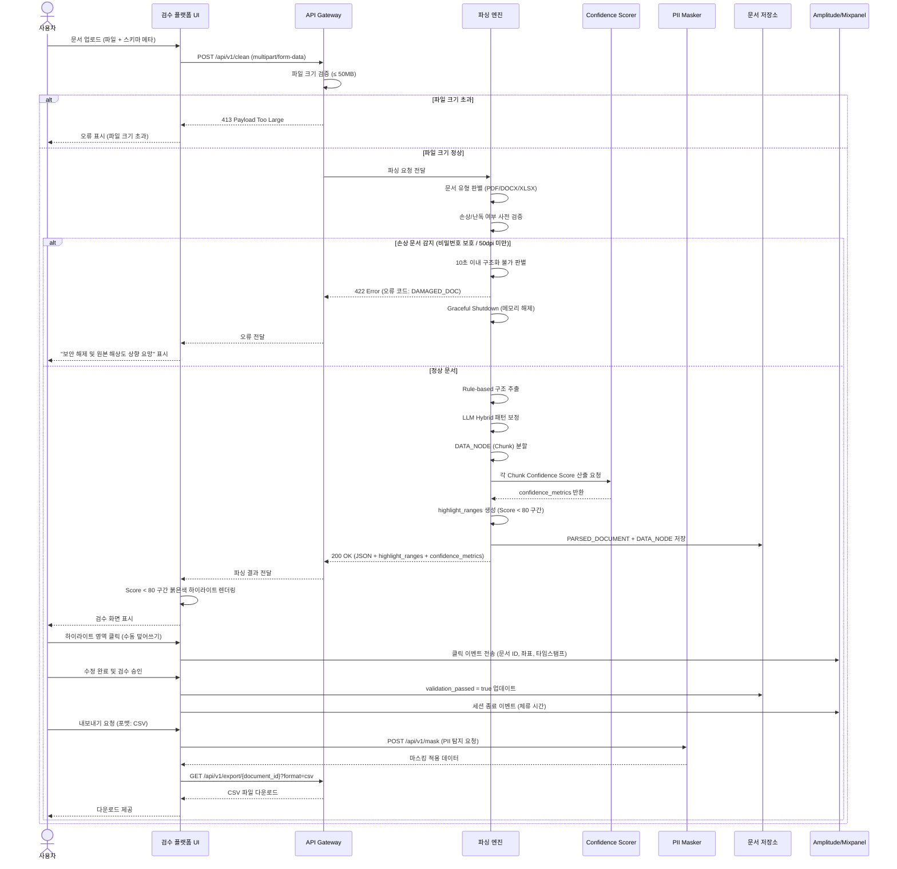
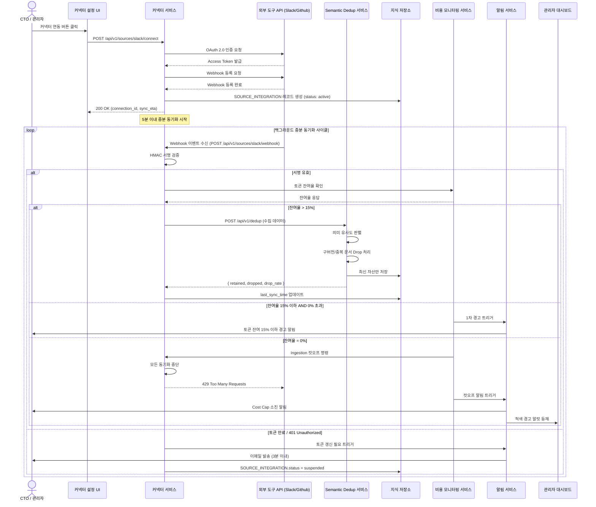
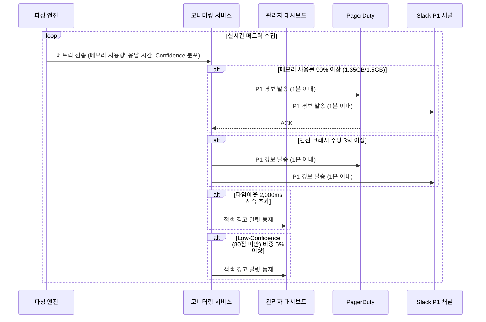

# Software Requirements Specification (SRS)

**Document ID**: SRS-001  
**Revision**: 0.1  
**Date**: 2026-04-15  
**Standard**: ISO/IEC/IEEE 29148:2018  

---

## 1. Introduction

### 1.1 Purpose

본 SRS는 **CorpBrain**(SME용 실시간 데이터 클리닝 OS)의 소프트웨어 요구사항을 정의한다. CorpBrain은 중소기업(SME)이 보유한 비정형 문서(도표·특수 양식 포함)를 로컬 환경에서 무결점 파싱하고, 파편화된 기업 지식 자산에서 구버전·중복 데이터를 자동 필터링하여 신뢰 가능한 정형 데이터로 변환하는 시스템이다.

본 문서는 다음 두 가지 핵심 문제를 해결하기 위한 시스템 요구사항을 명세한다:

1. **부티크 로펌**: 복잡한 법률 서식(도표)의 파싱 붕괴 및 환각으로 인한 수작업 검수 시간 과다(일 4시간 초과 비중 80% 이상) 및 데이터 추출 오류율 5% 초과.
2. **기술 스타트업**: 핵심 인력 퇴사로 인한 레거시 데이터 블랙박스화, 분절된 환경에서의 신규 온보딩 2주 이상 소요(비율 70%) 및 RAG 환각 사고 발생률 15% 초과.

**대상 독자**: 개발팀, QA팀, 프로덕트 매니저, 고객사 기술 담당자, 외부 감사자.

### 1.2 Scope

#### 1.2.1 In-Scope

| ID | 범위 항목 | 설명 |
|:---|:---|:---|
| SCO-01 | 로컬 폐쇄망 파서 엔진 | SME용 On-premise 환경에서 완전 구동 가능한 문서 파싱·클리닝 엔진 |
| SCO-02 | Semantic Dedup 필터링 로직 | 구버전·중복 문서의 의미 기반 자동 판별 및 배제 파이프라인 |
| SCO-03 | Confidence Score 하이라이터 UI | AI 파싱 확신도 80% 미만 구간을 시각적으로 표시하는 검수 인터페이스 |
| SCO-04 | 외부 커넥터 (Slack/Github) | 기존 협업 도구와의 웹훅/OAuth 기반 증분 동기화 커넥터 |
| SCO-05 | PII 오토 마스킹 | 민감 정보 자동 탐지 및 마스킹 처리 후 내보내기 |
| SCO-06 | 컨테이너 기반 배포 | Docker/K8s 플러그앤플레이 형태의 설치 패키지 |

#### 1.2.2 Out-of-Scope

| ID | 제외 항목 | 사유 |
|:---|:---|:---|
| EXC-01 | 비정형 문서 자동 기안/생성 에이전트 | 데이터 클리닝 배관에 리소스 집중 |
| EXC-02 | 프론트엔드 채팅 뷰어(RAG 봇) | 후방 데이터 클리닝 파이프라인 우선 |
| EXC-03 | 단독 SI 수주 기반 맞춤 개발 | SaaS/패키지 제품 전략 집중 |
| EXC-04 | 범용 음성/이미지 획득 모듈 | 현재 공략 구간(문서 기반) 비용 집중 |

#### 1.2.3 Constraints & Assumptions

**Constraints (제약사항)**

| ID | 유형 | 내용 |
|:---|:---|:---|
| CON-01 | 아키텍처 (ADR-001) | 인프라 종속성 배제를 위한 완전 컨테이너(Docker/K8s) 형태 배포 필수 |
| CON-02 | 아키텍처 (ADR-002) | LlamaParse 등 특정 오픈소스 파서 종속 방지를 위한 플러거블 패턴 채택 |
| CON-03 | 보안 | On-premise 배포 시 아웃바운드 통신 0 Byte 보장 (완전 폐쇄망 준수) |
| CON-04 | 비용 | 종량제 클라우드 API 대비 1년 운영 기준 비용 구조 80% 우위 유지 |
| CON-05 | 기술 리스크 | 특수 양식 Edge case 방어를 위한 Rule-based + LLM Hybrid 패턴 적용 |

**Assumptions (가정)**

| ID | 내용 |
|:---|:---|
| ASM-01 | 고객사 내 별도 파이썬/플랫폼 엔지니어 없이도 시스템 UI만으로 초기 세팅 종결 가능 |
| ASM-02 | 고객사가 Docker/K8s 실행 환경을 보유하거나 제공 가능 |
| ASM-03 | 연동 대상 외부 도구(Slack, Github, Notion)가 표준 OAuth 2.0 및 웹훅을 지원 |

### 1.3 Definitions, Acronyms, Abbreviations

| 용어 | 정의 |
|:---|:---|
| CorpBrain | SME용 실시간 데이터 클리닝 OS 제품명 |
| Semantic Dedup | 의미(Semantic) 기반 중복 제거. 텍스트의 의미적 유사도를 판별하여 구버전·중복 문서를 자동 배제하는 기법 |
| Confidence Score | AI 파싱 엔진이 추출 결과에 대해 산출하는 확신도 점수 (0~100) |
| TEDS-Struct | Tree-Edit-Distance-based Structural Similarity. 표 구조 인식 품질 평가 지표 |
| PII | Personally Identifiable Information. 개인식별정보(주민등록번호 등) |
| JTBD | Jobs to be Done. 사용자가 완수하려는 핵심 과업 |
| AOS | Adjusted Opportunity Score. 기회 보정 점수 |
| DOS | Discovered Opportunity Score. 발견된 기회 점수 |
| Validator | 요구사항 검증을 수행하는 역할 또는 도구 |
| Persona | 제품의 핵심 사용자 유형을 대표하는 가상 인물 모델 |
| MoSCoW | Must / Should / Could / Won't. 요구사항 우선순위 분류 기법 |
| RPO | Recovery Point Objective. 장애 시 허용 가능한 최대 데이터 손실 시점 |
| RTO | Recovery Time Objective. 장애 발생 후 서비스 복구 목표 시간 |
| SLA | Service Level Agreement. 서비스 수준 협약 |
| RBAC | Role-Based Access Control. 역할 기반 접근 제어 |
| Ingestion | 외부 소스에서 데이터를 수집·투입하는 프로세스 |
| Cost Cap | 사용자별 설정 가능한 월간 API 토큰 사용 상한 |
| Graceful Shutdown | 진행 중인 작업을 안전하게 완료 또는 정리한 후 프로세스를 종료하는 방식 |
| F1-Score | Precision과 Recall의 조화 평균. 정보 추출 정확도 평가 지표 |

### 1.4 References

| ID | 문서명 | 설명 |
|:---|:---|:---|
| REF-01 | PRD_CorpBrain v0.2 | CorpBrain PRD 원본 (2026-04-11, 다온 & 회비서) |
| REF-02 | ADR-001 | 인프라 정책: Docker/K8s 컨테이너 플러그앤플레이 배포 |
| REF-03 | ADR-002 | LlamaParse 등 오픈소스 생태계 종속 방지 플러거블 패턴 채택 |
| REF-04 | 가상 인터뷰 - 이지언 (부티크 로펌 대표) | Confidence 하이라이터 UI 도입 적합성 검증 근거 |
| REF-05 | 가상 인터뷰 - 김동현 (스타트업 CTO) | Semantic Dedup 및 백그라운드 커넥터 우선 개발 근거 |
| REF-06 | ISO/IEC/IEEE 29148:2018 | Systems and software engineering — Life cycle processes — Requirements engineering |

---

## 2. Stakeholders

| 역할 (Role) | 페르소나/대표 | 책임 (Responsibility) | 관심사 (Interest) |
|:---|:---|:---|:---|
| 핵심 사용자 1 (코어 1) | 이지언 - 부티크 특화 로펌 대표 | 법률 문서의 도표/특수 양식 파싱 결과 검수 및 승인 | 표 셀 병합·경계선 100% 복원, 저신뢰도 구간 시각화, 100% 로컬 보안 환경 구동, 검수 시간 87.5% 단축 |
| 핵심 사용자 2 (코어 2) | 김동현 - 시리즈 B 기술 스타트업 CTO | 기존 도구(Slack/Github) 연동 관리, 지식 파이프라인 운영 | 기존 툴 전환 마찰 0%, 구버전 문서 자동 필터링, 신입 온보딩 1시간 이내, API 과금 통제 |
| 시스템 관리자 | 고객사 IT 담당자 | On-premise 설치·운영, 모니터링 대시보드 관리, 토큰 한도 설정 | 컨테이너 기반 설치 용이성, 시스템 가용성 99.9%, 메모리/크래시 경보 수신 |
| 프로덕트 오너 | 다온 & 회비서 | 요구사항 정의, 우선순위 결정, 성공 지표 관리 | 북극성 KPI(파싱 성공률 99.9%) 달성, 시장 PMF 검증 |
| 개발팀 | CorpBrain 엔지니어링 팀 | 시스템 설계·구현·테스트 | 플러거블 아키텍처, 성능 목표 충족, 기술 부채 최소화 |
| QA팀 | 품질 보증 팀 | 요구사항 검증, 테스트 케이스 실행, 벤치마크 수행 | TEDS-Struct 벤치마크 통과, AC 충족 검증 |

---

## 3. System Context and Interfaces

### 3.1 External Systems

| ID | 외부 시스템 | 연동 방식 | 설명 |
|:---|:---|:---|:---|
| EXT-01 | Slack | OAuth 2.0 + Webhook | 채널/DM 메시지 및 파일 증분 동기화 |
| EXT-02 | Github | OAuth 2.0 + Webhook | 리포지터리 문서·이슈·PR 증분 동기화 |
| EXT-03 | Notion | OAuth 2.0 + Webhook | 페이지·데이터베이스 증분 동기화 |
| EXT-04 | 클라우드 LLM API | REST API (HTTPS) | Hybrid 모드 시 PII 마스킹 후 호출 (On-premise 모드에서는 미사용) |
| EXT-05 | PagerDuty | REST API (Webhook) | P1 경보 발송 채널 |
| EXT-06 | 이메일 서비스 (SMTP) | SMTP/API | 토큰 갱신 필요 알림 등 계정 담당자 통보 |
| EXT-07 | Amplitude / Mixpanel | SDK/API | 사용자 행동 추적(검수 체류 시간, 클릭 이벤트) |

### 3.2 Client Applications

| ID | 클라이언트 | 유형 | 설명 |
|:---|:---|:---|:---|
| CLI-01 | 검수 플랫폼 (Web UI) | 웹 애플리케이션 | Confidence Score 하이라이터 UI, 문서 검수·승인 워크플로우 |
| CLI-02 | 관리자 대시보드 (Web UI) | 웹 애플리케이션 | 시스템 모니터링, 토큰 한도 관리, 커넥터 관리, 알림 설정 |
| CLI-03 | 커넥터 설정 UI | 웹 애플리케이션 | 외부 도구(Slack/Github/Notion) 연동 버튼 및 상태 모니터 |

### 3.3 API Overview

| API 범주 | 엔드포인트 | Method | 설명 |
|:---|:---|:---|:---|
| Ingestion (외부 Connector) | `/api/v1/sources/{source_type}/connect` | POST | 외부 도구 OAuth 토큰 등록 및 웹훅 설정 |
| Ingestion (외부 Connector) | `/api/v1/sources/{source_type}/webhook` | POST | 외부 도구 변경 이벤트 수신 (Webhook Receiver) |
| Ingestion (외부 Connector) | `/api/v1/sources/{source_type}/sync` | GET | 증분 동기화 상태 조회 (Polling 방식 보조) |
| Internal Engine | `/api/v1/clean` | POST | 문서 파싱 및 클리닝 실행. Input: 파일 바이너리(≤50MB) + 스키마 메타. Output: 구조화 JSON + highlight_ranges + confidence_metrics |
| Internal Engine | `/api/v1/dedup` | POST | Semantic Dedup 실행. 수집된 데이터 노드 대상 중복·구버전 판별 및 배제 |
| Export (Outbound) | `/api/v1/export/{document_id}` | GET | 구조화 결과 내보내기 (JSON/CSV/XML/Vector DB Payload) |
| Export (Outbound) | `/api/v1/export/batch` | POST | 다건 문서 일괄 내보내기 |
| Admin | `/api/v1/workspace/{workspace_id}/cost-cap` | PUT | 월간 토큰 상한 설정 |
| Admin | `/api/v1/workspace/{workspace_id}/usage` | GET | 토큰 사용량 및 잔여율 조회 |
| PII Masking | `/api/v1/mask` | POST | PII 자동 탐지 및 마스킹 처리 |

### 3.4 Interaction Sequences (핵심 시퀀스 다이어그램)

#### 3.4.1 핵심 흐름 1: 문서 파싱 및 검수 (로펌 시나리오)

#### 3.4.2 핵심 흐름 2: 외부 도구 연동 및 Semantic Dedup (스타트업 시나리오)

---

## 4. Specific Requirements

### 4.1 Functional Requirements

#### 4.1.1 무결점 Table & Form Parser (F1 — Must Have)

| ID | 요구사항 | Source | Priority | Acceptance Criteria |
|:---|:---|:---|:---|:---|
| REQ-FUNC-001 | 시스템은 업로드된 법률 서식(도표, 문서 주석 포함)의 표 셀 병합 및 경계선을 99.9% 정확도로 정형 데이터 포맷(CSV/XML/Markdown)으로 추출해야 한다. | Story 1 / AC 1 | Must | **Given** 로펌 특화 양식(표, 문서 주석 포함)이 업로드되었을 때, **When** 로컬 클리닝 엔진이 파싱을 완료하면, **Then** 표 셀 병합과 경계선의 99.9%가 어긋남 없이 정형 데이터 포맷으로 추출된다. |
| REQ-FUNC-002 | 시스템은 Rule-based + LLM Hybrid 패턴을 적용하여 특수 양식 템플릿(로펌별 표준 계약서 템플릿 10종 이상)에 대한 파싱 정확도를 유지해야 한다. | F1 / CON-05 | Must | **Given** 사전 학습된 표준 계약서 템플릿 10종 중 하나에 해당하는 문서가 입력되었을 때, **When** 파싱 엔진이 처리하면, **Then** TEDS-Struct 점수가 외부 타사 A API 대비 +25pt 이상이어야 한다. |
| REQ-FUNC-003 | 시스템은 문서당 최대 50MB까지의 파일 바이너리를 수용하고, 스키마 템플릿 메타데이터와 함께 처리해야 한다. | F1 / API 명세 | Must | **Given** 50MB 이하의 파일과 스키마 메타가 `POST /api/v1/clean`으로 전송되었을 때, **When** 엔진이 요청을 수신하면, **Then** 정상적으로 파싱 프로세스를 시작하고, 50MB 초과 시 `413 Payload Too Large` 응답을 반환한다. |
| REQ-FUNC-004 | 시스템은 파싱 완료 시 구조화된 JSON 데이터 배열과 함께 `highlight_ranges` 및 `confidence_metrics` 객체를 포함한 응답을 반환해야 한다. | F1 / API 명세 | Must | **Given** 문서 파싱이 정상 완료되었을 때, **When** 엔진이 응답을 생성하면, **Then** 응답 본문에 구조화 JSON 배열, `highlight_ranges`(배열), `confidence_metrics`(객체)가 모두 포함되어야 한다. |

#### 4.1.2 Confidence Score 에러 하이라이터 UI (F2 — Must Have)

| ID | 요구사항 | Source | Priority | Acceptance Criteria |
|:---|:---|:---|:---|:---|
| REQ-FUNC-005 | 시스템은 AI 파싱 확신도(Confidence Score) 80% 미만인 데이터 영역을 검수 플랫폼 UI에서 붉은색으로 자동 하이라이트 표시해야 한다. | Story 1 / AC 2 | Must | **Given** 추출된 결과물을 사용자가 검수 플랫폼에서 열람할 때, **When** Confidence Score 80% 미만인 데이터가 감지되면, **Then** 해당 영역이 붉은색 하이라이트로 즉시 표시된다. |
| REQ-FUNC-006 | 시스템은 하이라이트 표시된 영역에 대해 사용자가 수동 덮어쓰기(Override) 할 수 있는 인터페이스를 제공해야 한다. | Story 1 / 보조 KPI 1 | Must | **Given** 붉은색 하이라이트가 적용된 셀/영역이 표시된 상태에서, **When** 사용자가 해당 영역을 클릭하면, **Then** 인라인 편집 모드로 전환되어 수동 데이터 입력 및 확정이 가능해야 한다. |
| REQ-FUNC-007 | 시스템은 문서별 검수 체류 시간(Session Duration) 및 셀 구조 수동 덮어쓰기 클릭 이벤트를 추적하여 Amplitude/Mixpanel로 전송해야 한다. | 보조 KPI 1 | Must | **Given** 사용자가 검수 플랫폼에서 문서를 열람 중일 때, **When** 세션 종료 또는 덮어쓰기 이벤트가 발생하면, **Then** 해당 이벤트 데이터(문서 ID, 체류 시간, 클릭 좌표, 타임스탬프)가 분석 도구로 전송된다. |

#### 4.1.3 가비지 선별 — Semantic Dedup (F3 — Should Have)

| ID | 요구사항 | Source | Priority | Acceptance Criteria |
|:---|:---|:---|:---|:---|
| REQ-FUNC-008 | 시스템은 수집된 문서 데이터에 대해 Semantic Dedup(의미 기반 중복 제거)을 수행하여 구버전 및 의미 없는 안내성 텍스트 문건의 90% 이상을 자동 배제해야 한다. | Story 2 / AC 2 | Should | **Given** 파편화된 과거 명세서 더미가 수집 엔진에 입력되었을 때, **When** Semantic Dedup 모듈이 처리를 완료하면, **Then** 구버전 및 안내성 텍스트 문건의 90% 이상이 자동 블록/배제되고 최신 자산만 저장된다. |
| REQ-FUNC-009 | 시스템은 Semantic Dedup 모듈에 의해 배제된 문서 건수를 로그로 기록하고, 전체 Ingestion 건수 대비 배제율을 산출 가능하도록 해야 한다. | 보조 KPI 2 | Should | **Given** Ingestion 파이프라인이 실행 완료되었을 때, **When** 배제 로그를 조회하면, **Then** 전체 진입 건수, 배제(Drop) 건수, 배제율(%) 데이터가 반환된다. |
| REQ-FUNC-010 | 시스템은 문서를 데이터 노드(Chunk) 단위로 분할하고, 각 노드에 `node_type`(Table/Text/Form), `semantic_content`, `confidence_score`, `is_obsolete` 속성을 부여해야 한다. | Entity 정의 | Should | **Given** 파싱된 문서가 청킹(chunking) 프로세스에 입력되었을 때, **When** 분할이 완료되면, **Then** 각 DATA_NODE에 `node_type`, `semantic_content`, `confidence_score`, `is_obsolete` 속성이 할당된다. |

#### 4.1.4 단일 클릭 백그라운드 커넥터 (F4 — Should Have)

| ID | 요구사항 | Source | Priority | Acceptance Criteria |
|:---|:---|:---|:---|:---|
| REQ-FUNC-011 | 시스템은 사용자가 커넥터 연동 버튼을 클릭한 후 5분 이내에 증분 동기화 셋업을 완료하고 백그라운드 가동을 시작해야 한다. | Story 2 / AC 1 | Should | **Given** 사용자가 기존 도구(Slack, Notion 등) 환경에서 CorpBrain 커넥터 연동 버튼을 클릭했을 때, **When** OAuth 인증 및 웹훅 등록이 처리되면, **Then** 5분 이내에 증분 동기화 셋업이 백그라운드에서 가동된다. |
| REQ-FUNC-012 | 시스템은 커넥터 연동 시 사용자의 기존 UI 워크플로우를 변경하지 않아야 한다. | Story 2 / AC 1 | Should | **Given** 커넥터가 활성화된 상태에서, **When** 사용자가 기존 도구(Slack/Github/Notion)를 사용할 때, **Then** 기존 도구의 인터페이스 및 워크플로우에 변경이 발생하지 않는다. |
| REQ-FUNC-013 | 시스템은 연동된 외부 도구의 API 토큰이 만료 또는 권한 축소로 `401 Unauthorized`를 반환할 경우, 3분 이내에 계정 담당자에게 "토큰 갱신 필요" 이메일을 발송하고 해당 프로세스를 휴면(Suspend) 모드로 전환해야 한다. | Story 2 / AC 4 | Should | **Given** 연동된 Slack/Github API 토큰이 Invalid 상태이고, **When** 증분 수집 요청 시 `401 Unauthorized`를 수신하면, **Then** 3분 이내에 계정 담당자에게 이메일이 발송되고 해당 프로세스 노드가 휴면 모드로 전환된다. |
| REQ-FUNC-014 | 시스템은 외부 연동 시 웹훅(Webhook) 방식을 우선 채택하고, Polling이 불가피한 경우 증분(Incremental) ID 기반으로 제한적 호출을 수행해야 한다. | API 명세 | Should | **Given** 외부 도구 연동이 설정될 때, **When** 동기화 방식을 결정하면, **Then** 웹훅 지원 여부를 우선 확인하고, 미지원 시에만 Incremental ID 기반 Polling으로 전환한다. |

#### 4.1.5 PII 오토 마스킹 컴플라이언스 (F5 — Could Have)

| ID | 요구사항 | Source | Priority | Acceptance Criteria |
|:---|:---|:---|:---|:---|
| REQ-FUNC-015 | 시스템은 파싱된 데이터에서 PII(주민등록번호, 기밀 데이터)를 자동 탐지하고 마스킹 처리한 후 내보내야 한다. | F5 | Could | **Given** PII를 포함한 문서가 파싱 완료되었을 때, **When** 내보내기(Export) 요청이 발생하면, **Then** PII 영역이 자동 탐지되어 마스킹 처리된 상태로 출력된다. |
| REQ-FUNC-016 | 시스템은 Hybrid 배포 아키텍처에서 클라우드 LLM 호출 전 PII를 로컬 망에서 마스킹/암호화 처리해야 한다. | NFR / 보안 | Could | **Given** Hybrid 모드에서 클라우드 LLM API 호출이 필요할 때, **When** 데이터를 외부로 전송하기 직전, **Then** 모든 PII 항목이 로컬 환경에서 마스킹/암호화 처리된 상태여야 한다. |

#### 4.1.6 실패/예외 처리 및 비용 제어

| ID | 요구사항 | Source | Priority | Acceptance Criteria |
|:---|:---|:---|:---|:---|
| REQ-FUNC-017 | 시스템은 비밀번호 보호 또는 해상도 50dpi 미만 손상 문서 업로드 시, 10초 이내에 정상 구조화 불가능을 판별하고, 구체적 오류 코드("보안 해제 및 원본 해상도 상향 요망")를 반환한 뒤 메모리 누수 없이 Graceful Shutdown을 수행해야 한다. | Story 1 / AC 4 | Must | **Given** 비밀번호 보호 또는 50dpi 미만 문서가 업로드되었을 때, **When** 클리닝 엔진이 파싱을 시도하여 10초 이내에 정상 구조화 불가능을 판별하면, **Then** 추론 루프를 즉시 중단하고 구체적 오류 코드를 반환하며 프로세스를 메모리 누수 없이 안전 종료한다. |
| REQ-FUNC-018 | 시스템은 실시간 API 동기화 중 사용자 설정 월 API 토큰 상한액(Cost Cap)을 초과하는 호출 발생 시, 즉시 100% 호출을 중단하고 경고 알림을 표시해야 한다. | Story 2 / AC 3 | Must | **Given** 실시간 API 동기화가 동작 중이고 월 토큰 상한이 설정된 상태에서, **When** 새로운 증분 호출이 Cost Cap을 초과할 경우, **Then** 즉시 모든 호출을 중단하고 사용자에게 경고 알림을 표시한다. |

#### 4.1.7 데이터 내보내기 (Export)

| ID | 요구사항 | Source | Priority | Acceptance Criteria |
|:---|:---|:---|:---|:---|
| REQ-FUNC-019 | 시스템은 구조화된 데이터를 JSON, CSV, XML, Vector DB Payload 포맷으로 내보내기를 지원해야 한다. | API 명세 / Export | Must | **Given** 파싱 및 검수가 완료된 문서가 존재할 때, **When** 사용자가 내보내기를 요청하면, **Then** JSON, CSV, XML, Vector DB Payload 중 선택한 포맷으로 데이터가 출력된다. |
| REQ-FUNC-020 | 시스템은 다건 문서 일괄 내보내기(Batch Export)를 지원해야 한다. | API 명세 | Should | **Given** 복수의 검증 완료 문서가 존재할 때, **When** `POST /api/v1/export/batch` 요청이 수신되면, **Then** 요청된 모든 문서가 지정 포맷으로 일괄 내보내기 처리된다. |

#### 4.1.8 워크스페이스 및 관리

| ID | 요구사항 | Source | Priority | Acceptance Criteria |
|:---|:---|:---|:---|:---|
| REQ-FUNC-021 | 시스템은 워크스페이스별로 On-premise 여부(`is_on_premise`), 클라이언트 ID, 월간 Cost Cap을 설정·관리할 수 있어야 한다. | Entity 정의 | Must | **Given** 관리자가 워크스페이스 설정 화면에 접근했을 때, **When** `is_on_premise`, `client_id`, `cost_cap` 값을 입력/변경하면, **Then** 해당 설정이 즉시 반영되어 시스템 동작에 적용된다. |
| REQ-FUNC-022 | 시스템은 On-premise 모드에서 모든 문서 파싱 및 렌더링 완료 시 외부 클라우드로 전송되는 아웃바운드 통신 볼륨이 정확히 0 Byte여야 한다. | Story 1 / AC 3 | Must | **Given** 고객사가 완전 폐쇄망(On-premise) 설치를 사용 중일 때, **When** 문서 파싱 및 렌더링을 완전히 마쳤을 때, **Then** 외부 클라우드로 전송되는 아웃바운드 통신이 정확히 0 Byte이다. |

---

### 4.2 Non-Functional Requirements

#### 4.2.1 성능 (Performance)

| ID | 요구사항 | 측정 기준 | 측정 방법 |
|:---|:---|:---|:---|
| REQ-NF-001 | 문서 장당 파싱 완료 소요 시간은 p95 기준 1,500ms 이하여야 한다. | p95 ≤ 1,500ms | 파싱 엔진 응답 시간 로그 수집, p95 percentile 산출 |
| REQ-NF-002 | 배치 파싱 시 증분 데이터(Delta) 수집 동기화 지연은 3분 이하여야 한다. | Sync Latency ≤ 3 min | 증분 동기화 시작~완료 타임스탬프 델타 측정 |
| REQ-NF-003 | 무결점 포맷 보존 파싱 성공률(북극성 KPI)은 99.9% 이상이어야 한다. | F1-Score ≥ 99.9% | 매주 금요일, 샘플 벤치마크 세트(n=100) F1-Score 계산 + ElasticSearch 파싱 실패 로그 쿼리 집계 |
| REQ-NF-004 | 도입 후 첫 파트너 툴 동기화 온보딩 소요 시간은 1시간 이내여야 한다. | Onboarding Time ≤ 1h | SaaS 계정 생성 시점 ~ 최초 파이프라인 동기화 `HTTP 200 OK` 수신 시점 간 타임스탬프 델타 |
| REQ-NF-005 | 기존 대안 클라우드 OCR API 대비 표 내 요소 변위 에러율(Cell displacement rate)이 10% 이하여야 한다 (90% 감소). | Cell Displacement Rate ≤ 10% | TEDS-Struct 벤치마크 + 1,000건 Dirty Form Dataset 시뮬레이션 |

#### 4.2.2 가용성 및 신뢰성 (Availability & Reliability)

| ID | 요구사항 | 측정 기준 | 측정 방법 |
|:---|:---|:---|:---|
| REQ-NF-006 | 클리닝 파서 시스템 월간 가용성은 99.9% 이상이어야 한다. | Monthly Uptime ≥ 99.9% | Uptime 모니터링 (월간 총 시간 대비 정상 가동 시간) |
| REQ-NF-007 | 파싱 엔진 크래시 및 오류율(Parser Error Rate)은 0.1% 이하여야 한다. | Error Rate ≤ 0.1% | 전체 파싱 요청 건수 대비 엔진 크래시/오류 건수 비율 |
| REQ-NF-008 | 파싱 처리 중 메모리 사용률이 1.5GB 한도의 90%에 도달하거나 엔진 크래시가 주당 3회 이상 발생 시, 1분 이내에 PagerDuty/Slack P1 채널로 경보를 발송해야 한다. | Alert Latency ≤ 1 min | PagerDuty/Slack 경보 수신 타임스탬프 - 이벤트 발생 타임스탬프 |

#### 4.2.3 보안 (Security)

| ID | 요구사항 | 측정 기준 | 측정 방법 |
|:---|:---|:---|:---|
| REQ-NF-009 | On-premise 배포 시 아웃바운드 통신 볼륨은 0 Byte여야 한다. | Outbound Traffic = 0 Byte | 네트워크 패킷 캡처(tcpdump) 및 방화벽 로그 분석 |
| REQ-NF-010 | Hybrid 배포 시 PII는 클라우드 LLM 전송 전 반드시 로컬 환경에서 마스킹/암호화 처리되어야 한다. | PII Leakage = 0건 | 클라우드 전송 Payload 대상 PII 패턴 스캔 검사 |
| REQ-NF-011 | 타사 OAuth 토큰은 순환 리프레시(Rotation) 보안을 유지해야 하며, API Rate Limit을 준수해야 한다. | Token Rotation 준수율 = 100% | OAuth 토큰 갱신 로그, Rate Limit 초과 발생 건수 |

#### 4.2.4 비용 (Cost)

| ID | 요구사항 | 측정 기준 | 측정 방법 |
|:---|:---|:---|:---|
| REQ-NF-012 | 로컬 구동 시 종량제 클라우드 API 대비 1년 운영 기준 비용 구조가 80% 우위여야 한다. | 연간 운영비 ≤ 클라우드 대안의 20% | 연간 TCO 비교 분석 |
| REQ-NF-013 | Semantic Dedup 적용을 통해 클라우드 LLM 토큰 처리 비용 및 Vector DB 볼륨 유지비를 60% 이상 절감해야 한다. | 비용 절감률 ≥ 60% | Dedup 적용 전/후 토큰 소비량 및 스토리지 비용 비교 |
| REQ-NF-014 | 월간 토큰 제한치 대비 소모 잔여율 15% 이하 진입 시 1차 계정자 경고 알림을 전송해야 한다. 토큰 0% 소진 시 시스템 강제 Ingestion 컷오프 및 `HTTP 429 Too Many Requests` 응답을 해야 한다. | 1차 경고: 잔여 15% / 컷오프: 0% | 토큰 사용량 모니터링 대시보드, 알림 발송 로그 |

#### 4.2.5 운영/모니터링 (Monitoring & Operations)

| ID | 요구사항 | 측정 기준 | 측정 방법 |
|:---|:---|:---|:---|
| REQ-NF-015 | 시스템 문서 전처리 중 타임아웃(2,000ms 지속 초과) 및 Confidence 80점 미만 하이라이터 발생 비중이 전체 처리량의 5% 이상 도달 시 관리자 대시보드에 적색 경고 알럿을 등재해야 한다. | Alert 등재 기준: Timeout > 2,000ms 지속 또는 Low-Confidence ≥ 5% | 실시간 처리 지표 대시보드 모니터링 |

#### 4.2.6 확장성 (Scalability)

| ID | 요구사항 | 측정 기준 | 측정 방법 |
|:---|:---|:---|:---|
| REQ-NF-016 | 시스템은 Docker/K8s 컨테이너 기반으로 배포되어 수평 확장(Horizontal Scaling)이 가능해야 한다. | 컨테이너 인스턴스 추가 시 선형 처리량 증가 | 부하 테스트(Load Test) 시 인스턴스 수 대비 처리량 측정 |
| REQ-NF-017 | 시스템은 1,000건의 특수 양식 표본 세트를 일괄 처리할 수 있어야 한다. | Batch 처리: 1,000건/세션 | 벤치마크 시뮬레이션 결과 |

#### 4.2.7 유지보수성 (Maintainability)

| ID | 요구사항 | 측정 기준 | 측정 방법 |
|:---|:---|:---|:---|
| REQ-NF-018 | 파싱 엔진은 플러거블(Pluggable) 패턴으로 설계되어 특정 오픈소스 파서(LlamaParse 등)에 종속되지 않아야 한다. | 파서 교체 시 인터페이스 코드 변경 범위 ≤ 1개 모듈 | 아키텍처 리뷰, 파서 교체 테스트 |
| REQ-NF-019 | 고객사 내 별도 파이썬/플랫폼 엔지니어 없이도 시스템 UI만으로 초기 세팅이 종결 가능해야 한다. | 비개발자 세팅 성공률 = 100% | 비개발자 대상 유저빌리티 테스트 |

---

## 5. Traceability Matrix

### 5.1 Story ↔ Requirement ID ↔ Test Case ID

| Story | Requirement ID | Priority | Test Case ID | 테스트 유형 |
|:---|:---|:---|:---|:---|
| Story 1 / AC 1 | REQ-FUNC-001 | Must | TC-001 | 통합 테스트 (파싱 정확도) |
| Story 1 / AC 1 | REQ-FUNC-002 | Must | TC-002 | 벤치마크 테스트 (TEDS-Struct) |
| Story 1 / AC 1 | REQ-FUNC-003 | Must | TC-003 | 단위 테스트 (파일 크기 검증) |
| Story 1 / AC 1 | REQ-FUNC-004 | Must | TC-004 | 단위 테스트 (응답 스키마 검증) |
| Story 1 / AC 2 | REQ-FUNC-005 | Must | TC-005 | UI 테스트 (하이라이트 렌더링) |
| Story 1 / AC 2 | REQ-FUNC-006 | Must | TC-006 | UI 테스트 (수동 덮어쓰기) |
| 보조 KPI 1 | REQ-FUNC-007 | Must | TC-007 | 통합 테스트 (이벤트 추적) |
| Story 2 / AC 2 | REQ-FUNC-008 | Should | TC-008 | 통합 테스트 (Dedup 필터링률) |
| 보조 KPI 2 | REQ-FUNC-009 | Should | TC-009 | 단위 테스트 (로그 산출) |
| Entity 정의 | REQ-FUNC-010 | Should | TC-010 | 단위 테스트 (Chunk 속성) |
| Story 2 / AC 1 | REQ-FUNC-011 | Should | TC-011 | E2E 테스트 (연동 셋업 시간) |
| Story 2 / AC 1 | REQ-FUNC-012 | Should | TC-012 | UI 테스트 (워크플로우 비간섭) |
| Story 2 / AC 4 | REQ-FUNC-013 | Should | TC-013 | 통합 테스트 (토큰 만료 처리) |
| API 명세 | REQ-FUNC-014 | Should | TC-014 | 단위 테스트 (연동 방식 결정) |
| F5 | REQ-FUNC-015 | Could | TC-015 | 통합 테스트 (PII 탐지/마스킹) |
| NFR / 보안 | REQ-FUNC-016 | Could | TC-016 | 보안 테스트 (클라우드 전송 전 마스킹) |
| Story 1 / AC 4 | REQ-FUNC-017 | Must | TC-017 | 통합 테스트 (손상 문서 예외 처리) |
| Story 2 / AC 3 | REQ-FUNC-018 | Must | TC-018 | 통합 테스트 (Cost Cap 컷오프) |
| API 명세 | REQ-FUNC-019 | Must | TC-019 | 단위 테스트 (Export 포맷 검증) |
| API 명세 | REQ-FUNC-020 | Should | TC-020 | 통합 테스트 (Batch Export) |
| Entity 정의 | REQ-FUNC-021 | Must | TC-021 | 단위 테스트 (워크스페이스 CRUD) |
| Story 1 / AC 3 | REQ-FUNC-022 | Must | TC-022 | 보안 테스트 (네트워크 캡처) |

### 5.2 KPI / NFR ↔ Requirement ID ↔ Test Case ID

| KPI / NFR 출처 | Requirement ID | Test Case ID | 테스트 유형 |
|:---|:---|:---|:---|
| p95 응답 시간 | REQ-NF-001 | TC-NF-001 | 성능 테스트 (부하) |
| 증분 동기화 지연 | REQ-NF-002 | TC-NF-002 | 통합 테스트 (동기화) |
| 북극성 KPI (파싱 성공률) | REQ-NF-003 | TC-NF-003 | 벤치마크 테스트 (주간) |
| 보조 KPI 3 (온보딩 시간) | REQ-NF-004 | TC-NF-004 | E2E 테스트 (온보딩 시나리오) |
| Cell Displacement Rate | REQ-NF-005 | TC-NF-005 | 벤치마크 테스트 (경쟁사 비교) |
| 월간 가용성 | REQ-NF-006 | TC-NF-006 | 운영 모니터링 (SLA) |
| 파서 오류율 | REQ-NF-007 | TC-NF-007 | 안정성 테스트 (장기 구동) |
| 메모리/크래시 경보 | REQ-NF-008 | TC-NF-008 | 장애 주입 테스트 (Chaos) |
| 아웃바운드 통신 0 Byte | REQ-NF-009 | TC-NF-009 | 보안 테스트 (패킷 캡처) |
| PII 클라우드 전송 방지 | REQ-NF-010 | TC-NF-010 | 보안 테스트 (Payload 스캔) |
| OAuth 토큰 순환 | REQ-NF-011 | TC-NF-011 | 보안 테스트 (토큰 갱신) |
| 연간 비용 구조 | REQ-NF-012 | TC-NF-012 | TCO 분석 (비교 리포트) |
| Dedup 비용 절감 | REQ-NF-013 | TC-NF-013 | 비용 비교 분석 |
| 토큰 경고/컷오프 | REQ-NF-014 | TC-NF-014 | 통합 테스트 (임계치 트리거) |
| 타임아웃/Low-Conf 알럿 | REQ-NF-015 | TC-NF-015 | 모니터링 테스트 (대시보드) |
| 수평 확장 | REQ-NF-016 | TC-NF-016 | 부하 테스트 (스케일 아웃) |
| 배치 처리 용량 | REQ-NF-017 | TC-NF-017 | 성능 테스트 (1,000건) |
| 플러거블 파서 | REQ-NF-018 | TC-NF-018 | 아키텍처 리뷰 |
| 비개발자 세팅 | REQ-NF-019 | TC-NF-019 | 유저빌리티 테스트 |

---

## 6. Appendix

### 6.1 API Endpoint List

| # | Method | Endpoint | 설명 | Request Body | Response | 제약 |
|:---|:---|:---|:---|:---|:---|:---|
| 1 | POST | `/api/v1/clean` | 문서 파싱 및 클리닝 | 파일 바이너리 (≤50MB) + 스키마 템플릿 메타 (multipart/form-data) | `200`: `{ data: [{...}], highlight_ranges: [...], confidence_metrics: {...} }` / `413`: Payload Too Large / `422`: 손상 문서 오류 | 파일 크기 ≤ 50MB; On-premise 시 외부 통신 0 |
| 2 | POST | `/api/v1/dedup` | Semantic Dedup 실행 | `{ workspace_id, node_ids: [...] }` | `200`: `{ retained: [...], dropped: [...], drop_rate: float }` | - |
| 3 | POST | `/api/v1/sources/{source_type}/connect` | 외부 도구 OAuth 연동 | `{ auth_token, webhook_url, workspace_id }` | `200`: `{ connection_id, status, sync_eta }` | OAuth 2.0 준수; source_type: slack, github, notion |
| 4 | POST | `/api/v1/sources/{source_type}/webhook` | Webhook 이벤트 수신 | 외부 도구별 이벤트 Payload | `200`: ACK | HMAC 서명 검증 필수 |
| 5 | GET | `/api/v1/sources/{source_type}/sync` | 증분 동기화 상태 조회 | Query: `workspace_id`, `since` (Incremental ID) | `200`: `{ status, last_sync, pending_items }` | Polling fallback 전용 |
| 6 | GET | `/api/v1/export/{document_id}` | 단건 문서 내보내기 | Query: `format` (json/csv/xml/vector) | `200`: 해당 포맷 데이터 | PII 마스킹 적용 후 출력 |
| 7 | POST | `/api/v1/export/batch` | 다건 문서 일괄 내보내기 | `{ document_ids: [...], format }` | `200`: `{ export_url, status }` | 비동기 처리, 완료 시 콜백 |
| 8 | PUT | `/api/v1/workspace/{workspace_id}/cost-cap` | 월간 토큰 상한 설정 | `{ monthly_cap: number }` | `200`: `{ workspace_id, monthly_cap, updated_at }` | 관리자 권한 필수 |
| 9 | GET | `/api/v1/workspace/{workspace_id}/usage` | 토큰 사용량 조회 | - | `200`: `{ used, remaining, remaining_pct, cap }` | - |
| 10 | POST | `/api/v1/mask` | PII 자동 마스킹 | `{ content, mask_types: [...] }` | `200`: `{ masked_content, detected_pii_count }` | 로컬 처리 전용 |

### 6.2 Entity & Data Model

#### 6.2.1 WORKSPACE

| 필드명 | 데이터 타입 | 제약 | 설명 |
|:---|:---|:---|:---|
| `id` | STRING | PK, UUID v4 | 워크스페이스 고유 식별자 |
| `client_id` | STRING | NOT NULL, FK → CLIENT | 고객사 식별자 |
| `is_on_premise` | BOOLEAN | NOT NULL, DEFAULT false | 완전 폐쇄망 배포 여부 |
| `cost_cap` | FLOAT | NOT NULL, DEFAULT 0 | 월간 API 토큰 사용 상한 (0 = 무제한) |
| `created_at` | TIMESTAMP | NOT NULL | 생성 시각 |
| `updated_at` | TIMESTAMP | NOT NULL | 최종 수정 시각 |

#### 6.2.2 SOURCE_INTEGRATION

| 필드명 | 데이터 타입 | 제약 | 설명 |
|:---|:---|:---|:---|
| `id` | STRING | PK, UUID v4 | 연동 고유 식별자 |
| `workspace_id` | STRING | FK → WORKSPACE.id, NOT NULL | 소속 워크스페이스 |
| `source_type` | ENUM | NOT NULL, VALUES: 'Slack', 'Github', 'Notion', 'Local' | 연동 소스 유형 |
| `auth_token` | STRING (encrypted) | NOT NULL | OAuth 인증 토큰 (AES-256 암호화 저장) |
| `webhook_url` | STRING | NULLABLE | 웹훅 수신 URL |
| `last_sync_time` | TIMESTAMP | NULLABLE | 최종 동기화 시각 |
| `status` | ENUM | NOT NULL, VALUES: 'active', 'suspended', 'disconnected' | 연동 상태 |
| `created_at` | TIMESTAMP | NOT NULL | 생성 시각 |

#### 6.2.3 PARSED_DOCUMENT

| 필드명 | 데이터 타입 | 제약 | 설명 |
|:---|:---|:---|:---|
| `id` | STRING | PK, UUID v4 | 파싱 문서 고유 식별자 |
| `workspace_id` | STRING | FK → WORKSPACE.id, NOT NULL | 소속 워크스페이스 |
| `source_integration_id` | STRING | FK → SOURCE_INTEGRATION.id, NULLABLE | 원본 소스 연동 ID (로컬 업로드 시 NULL) |
| `original_file_name` | STRING | NOT NULL | 원본 파일명 |
| `file_type` | STRING | NOT NULL | 파일 유형 (pdf, docx, xlsx 등) |
| `file_size_bytes` | BIGINT | NOT NULL, CHECK ≤ 52,428,800 | 파일 크기 (바이트, 최대 50MB) |
| `validation_passed` | BOOLEAN | NOT NULL, DEFAULT false | 검수 승인 완료 여부 |
| `parse_status` | ENUM | NOT NULL, VALUES: 'pending', 'processing', 'completed', 'failed' | 파싱 상태 |
| `error_code` | STRING | NULLABLE | 파싱 실패 시 오류 코드 |
| `created_at` | TIMESTAMP | NOT NULL | 생성 시각 |
| `parsed_at` | TIMESTAMP | NULLABLE | 파싱 완료 시각 |

#### 6.2.4 DATA_NODE (Chunk)

| 필드명 | 데이터 타입 | 제약 | 설명 |
|:---|:---|:---|:---|
| `id` | STRING | PK, UUID v4 | 데이터 노드 고유 식별자 |
| `document_id` | STRING | FK → PARSED_DOCUMENT.id, NOT NULL | 소속 문서 ID |
| `node_type` | ENUM | NOT NULL, VALUES: 'Table', 'Text', 'Form' | 노드 유형 |
| `semantic_content` | TEXT | NOT NULL | 의미 분석용 콘텐츠 |
| `structured_data` | JSON | NULLABLE | 구조화된 데이터 (표 셀 등) |
| `confidence_score` | FLOAT | NOT NULL, CHECK 0.0 ≤ value ≤ 100.0 | AI 파싱 확신도 점수 |
| `is_obsolete` | BOOLEAN | NOT NULL, DEFAULT false | 구버전/중복 문서 여부 (Semantic Dedup 결과) |
| `highlight_ranges` | JSON | NULLABLE | 하이라이트 대상 영역 정보 |
| `ordinal` | INTEGER | NOT NULL | 문서 내 노드 순서 |
| `created_at` | TIMESTAMP | NOT NULL | 생성 시각 |

### 6.3 Detailed Interaction Models (상세 시퀀스 다이어그램)

#### 6.3.1 상세 흐름 1: 문서 업로드 → 파싱 → 검수 → 내보내기 전체 흐름

#### 6.3.2 상세 흐름 2: 외부 커넥터 연동 → 증분 동기화 → Dedup → Cost Cap 제어

#### 6.3.3 상세 흐름 3: 모니터링 경보 흐름

### 6.4 Validation Plan (검증 계획)

#### 6.4.1 베타 채널 (PoC 가동 타겟)

| 항목 | 내용 |
|:---|:---|
| 대상 | 부티크 로펌 3개 파트너스 + 시리즈 B급 R&D 스타트업 5개사 |
| 운영 기간 | 2~4주 Closed Beta |
| 검증 데이터셋 | 1,000건 특수 얼룩 표본 세트(Dirty Form Dataset) |
| 측정 도구 | TEDS-Struct 점수 + F1-Score 동시 측정 |
| MVP 릴리즈 통과 기준 | TEDS-Struct 점수가 외부 타사 A API 대비 +25pt 이상 우위 |

#### 6.4.2 실험 가설

| # | 가설 | 측정 지표 | 성공 기준 |
|:---|:---|:---|:---|
| 1 | Confidence 80 미만 붉은색 하이라이터 UI 부여 시, 변호사 검수 소요 시간이 경쟁 툴 대비 3배 이상 빠름 | 평균 문서당 UI 검수 승인완료까지 클릭 시간, 만족도 평가 5점 척도 | 처리 시간 80% 감소 + 만족도 평균 4.5 초과 |
| 2 | Slack 원클릭 커넥터 + Semantic Dedup 적용 시, 기존 RAG 대비 환각 팩트체크 실패율 유의미 감소 | A/B 테스트: 기존 RAG vs CorpBrain 클리닝 후 RAG 정답률 | 구버전 레퍼런스 오참조 횟수 5% 미만 유지 |

---

*End of Document — SRS-001 v1.0*
