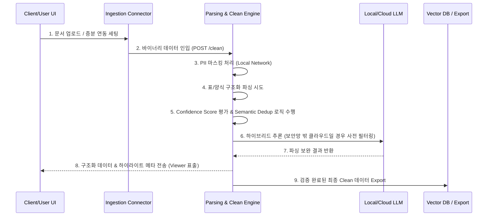
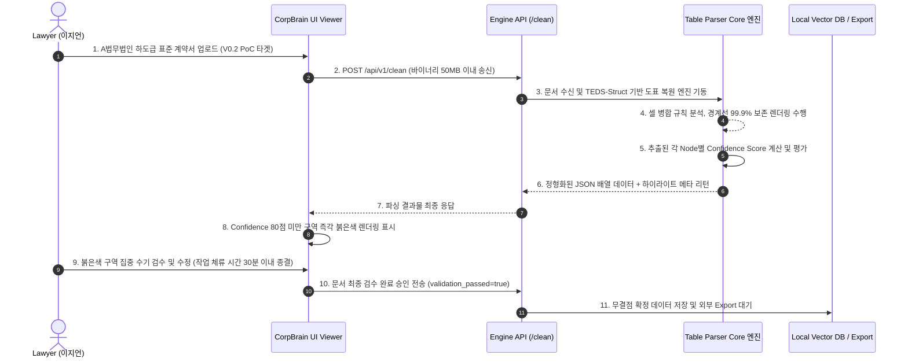

# Software Requirements Specification (SRS)
Document ID: SRS-001
Revision: 0.1
Date: 2026-04-22
Standard: ISO/IEC/IEEE 29148:2018

-------------------------------------------------
## 1. Introduction

### 1.1 Purpose
본 문서는 SME용 실시간 데이터 클리닝 OS인 'CorpBrain'의 소프트웨어 요구사항을 정의합니다. 본 시스템의 주요 목적은 부티크 로펌에서 발생하는 복잡한 법률 서식(도표)의 파싱 붕괴 및 환각 발생 문제를 해결하고, 기술 스타트업의 인력 퇴사로 인한 레거시 데이터 블랙박스화 및 분절된 환경 문제를 타개하는 데 있습니다. 이를 통해 문서 검수 시간을 극단적으로 단축하고 지식 관리의 온보딩 효율을 높입니다.

### 1.2 Scope
**[In-Scope]**
- SME용 로컬 폐쇄망 파서 엔진 구현 (A 법무법인의 하도급 표준 계약서 1종 우선 집중, V0.2 PoC 타겟).
- 구버전 및 가비지 데이터 필터링 로직 (Semantic Dedup).
- 파싱 확신도(Confidence) 기반 저신뢰도 구간 붉은색 하이라이터 UI 제공.
- Slack/Github 백그라운드 원클릭 커넥터 및 동기화 모듈 제공.
- PII(개인 식별 정보) 데이터 로컬 자동 마스킹/암호화 기능.

**[Out-of-Scope]**
- 비정형 문서를 새로 자동 기안하거나 생성하는 에이전트 모듈.
- 복잡한 자체 프론트엔드 채팅 뷰어(단순 검수 뷰어 이외의 RAG 봇 자체 제작 배제).
- 단독 SI 수주 기반의 고객 맞춤형 커스텀 개발.
- 타이핑 불가 직무를 위한 범용 음성 인식 및 이미지 획득(단순 OCR 사진) 로직.

### 1.3 Definitions, Acronyms, Abbreviations
- **Confidence Score**: AI가 문서를 파싱한 결과에 대해 가지는 확신도로, 80% 미만일 경우 하이라이트 검수 대상이 됩니다.
- **Semantic Dedup**: 의미 기반 중복 제거 기술로, 시스템 파이프라인 인입 전 쓰레기 문서 및 구버전 데이터를 자동 필터링합니다.
- **TEDS-Struct**: Tree-Edit-Distance-based Metric으로, 자동 표 인식 성능을 평가하는 벤치마크 지표입니다.
- **PII (Personally Identifiable Information)**: 개인 식별 정보 (주민등록번호, 기밀 데이터 등).
- **AOS/DOS**: Adjusted/Discovered Opportunity Score (기회 점수).

### 1.4 References
- **REF-01**: 가상 인터뷰 덤프 - 이지언 변호사 (하이라이터 UI 및 체류 시간 단축 ROI 검증 근거).
- **REF-02**: 가상 인터뷰 덤프 - 김동현 CTO (Semantic Dedup 및 백그라운드 연동 ROI 검증 근거).
- **REF-03**: ADR-001 (인프라 종속성을 끊는 완전한 컨테이너 기반 플러그앤플레이 아키텍처 정책).
- **REF-04**: ADR-002 (오픈소스 생태계 종속 회피를 위한 플러거블 패턴 채택 링크 연계).

### 1.5 Constraints and Assumptions
**[Constraints (제약 및 리스크 관리)]**
- (경쟁 리스크) 파서 API 단가 하방 압력에 대응하기 위해, 시스템은 단순 인식/변환 외에 폴더 재구성 및 의미 단위 솎아내기(Dedup)에 고도화 역량을 집중해야 합니다.
- (기술 리스크) 예외 케이스(Edge case) 방어를 위해, 시스템은 탑 티어 로펌 표준 계약서 10여 종을 사전 학습하여 Rule-based와 LLM의 Hybrid 패턴 구조를 강제합니다.
- (보안 제약) 완전 폐쇄망 요구 고객사에는 아웃바운드 트래픽이 0 Byte인 로컬 온프레미스 배포가 강제됩니다. PII는 클라우드 전송 전 무조건 로컬 망에서 마스킹/암호화되어야 합니다(Hybrid 아키텍처 필수).

**[Assumptions (가정)]**
- 플랫폼 내 초기 세팅은 별도의 숙련된 파이썬/플랫폼 엔지니어 개입 없이 시스템 UI만으로 종결된다고 가정합니다.

---

## 2. Stakeholders

- **Role: 이지언 (부티크 특화 로펌 대표 / Core 1)**
  - **Responsibility**: 법률 문서 실사, 결과 데이터 최종 검수 및 법률적 리스크 통제.
  - **Interest**: 100% 로컬 보안 환경 내 표/특수 양식의 완벽한 정밀 파싱 보장, 저신뢰도 구간 시각화(하이라이트)를 통한 수기 대조 업무 극단적 단축 (일 4h → 30m 이내).

- **Role: 김동현 (시리즈 B 기술 스타트업 CTO / Core 2)**
  - **Responsibility**: 사내 파편화 지식 중앙화, 신입 개발자 온보딩 리드 및 시스템 비용 관리.
  - **Interest**: 기존 Slack/Github 워크플로우의 마찰 없는 백그라운드 연동, 구버전/쓰레기 문서 자동 차단을 통한 RAG 환각 억제 및 토큰 최적화.

---

## 3. System Context and Interfaces

### 3.1 External Systems
- **데이터 소스 저장소**: Slack, Github, 로컬 파일 시스템 (On-premise NAS 등).
- **타겟 연동 시스템**: 외부 RAG 파이프라인, 범용 Vector DB, 외부 클라우드 LLM.

### 3.2 Client Applications
- **CorpBrain Admin Dashboard**: API 과금 캡 제어, 시스템 부하 모니터링, 토큰 초과 경보 알럿 확인.
- **CorpBrain Viewer UI**: 파싱 완료 데이터 렌더링 열람, 붉은색 하이라이터 구간 확인 및 셀 구조 수동 덮어쓰기 기능 지원.

### 3.3 API Overview
- **External Connector API (Ingestion)**: 웹훅(Webhook) 우선 채택, 증분(Incremental) ID 기반 제한적 Polling 수행. 타사 OAuth 토큰 순환 리프레시 및 Rate Limit 우회 로직 포함.
- **Internal Engine API (Parsing & Cleaning)**: `POST /api/v1/clean` (Input: 50MB 제한 바이너리 및 템플릿 메타 → Output: 정형 JSON 배열 및 Confidence Metrics 반환).
- **Export API (Outbound)**: 통합 JSON, CSV, 표준 XML 덤프 및 기존 RAG Vector DB용 범용 구조화 Payload 전송 지원.

### 3.4 Interaction Sequences

---

## 4. Specific Requirements

### 4.1 Functional Requirements

| ID | Source | Priority | Requirement Description | Acceptance Criteria (AC) |
|---|---|---|---|---|
| REQ-FUNC-001 | Story 1 / F1 | Must | 로펌 특화 양식(표, 주석) 정형 데이터 파싱 | **Given** 로펌 특화 양식이 업로드되었을 때, **When** 로컬 엔진이 파싱을 완료하면, **Then** 셀 병합과 경계선의 99.9%가 어긋남 없이 정형 데이터 포맷(CSV/XML/Markdown)으로 추출되어야 한다. |
| REQ-FUNC-002 | Story 1 / F1 | Must | 난독/손상 문서 처리 및 무한 루프 방지 | **Given** 암호화나 50dpi 미만의 손상/난독 문서가 업로드되었을 때, **When** 10초 내 파싱 불가를 판별하면, **Then** 오류 코드를 반환하고 메모리 누수 없이 프로세스를 안전 종료(Graceful shutdown)해야 한다. |
| REQ-FUNC-003 | Story 1 / F2 | Must | 파싱 확신도 산출 및 저신뢰도 구간 UI 하이라이트 | **Given** 추출 결과물을 검수 플랫폼(Viewer)에서 열람할 때, **When** AI 파싱 확신도가 80% 미만으로 감지되면, **Then** 해당 영역을 즉시 붉은색으로 하이라이트 표시해야 한다. |
| REQ-FUNC-004 | Story 2 / F4 | Should | 툴 변경 없는 단일 클릭 백그라운드 커넥터 연동 | **Given** 사용자가 사용 중인 기존 도구(Slack, Notion 등) 환경에서, **When** 커넥터 연동 버튼 클릭 시, **Then** 5분 이내에 증분 동기화 셋업이 백그라운드에서 가동 완료되어야 한다. |
| REQ-FUNC-005 | Story 2 / F3 | Should | 가비지 데이터 의미 기반 사전 필터링 (Semantic Dedup) | **Given** 파편화된 과거 문서 더미가 수집 엔진에 인입될 때, **When** Semantic Dedup을 거치면, **Then** 구버전 및 안내성 텍스트 문건의 90% 이상이 자동 배제되어 최신 자산만 남아야 한다. |
| REQ-FUNC-006 | Story 2 / F4 | Must | 토큰 만료 처리 및 휴면 모드 자동 전환 | **Given** 연동 완료된 API 토큰이 권한 만료로 인해 Invalid 되었을 때, **When** 401 Unauthorized 오류가 반환되면, **Then** 담당자에게 3분 내 이메일 알림 발송 후 프로세스 노드를 휴면(Suspend) 모드로 전환해야 한다. |
| REQ-FUNC-007 | F5 | Could | 민감 정보(PII) 오토 마스킹 컴플라이언스 처리 | **Given** 문서 내 식별 가능한 PII가 존재할 때, **When** 클라우드 LLM 등 외부 연동 전송 시그널이 발생하기 전, **Then** 반드시 로컬 망 내에서 마스킹 및 암호화 처리가 100% 완료되어야 한다. |
| REQ-FUNC-008 | F1 | Must | V0.2 첫 스프린트 PoC 타겟 락인(Lock-in) 방어 | **Given** A 법무법인의 하도급 표준 계약서 문서가 엔진에 주어졌을 때, **When** 시스템이 처리를 수행하면, **Then** 1주 내 스프린트 릴리즈가 가능하도록 완벽한 파싱 성공 결과를 제공해야 한다. |

### 4.2 Non-Functional Requirements

| ID | Category | Requirement Description | Target Metric / Acceptance Criteria |
|---|---|---|---|
| REQ-NF-001 | Performance | 파싱 처리 Latency (응답 시간) | 문서 장당 파싱 완료 소요 시간 p95 ≤ 1,500 ms 보장 |
| REQ-NF-002 | Performance | 데이터 동기화 Throughput | 배치 파싱 시 증분 데이터(Delta) 수집 동기화 지연 ≤ 3 minutes |
| REQ-NF-003 | Availability | 시스템 SLA (가용성) | 클리닝 파서 시스템 월간 가용성 ≥ 99.9% 유지 |
| REQ-NF-004 | Reliability | 엔진 에러율 및 크래시 제어 | 문서 처리 과정(Parser Error Rate) 중 엔진 크래시 및 오류율 ≤ 0.1% 통제 |
| REQ-NF-005 | Security | 데이터 유출 통제 (망분리 철저 준수) | 고객사 완전 폐쇄망 요구 시 외부 클라우드 아웃바운드 트래픽 0 Byte 유지 |
| REQ-NF-006 | Cost | API 운영 비용 효율 구조 최적화 | 로컬 구동 기준, 기존 범용 클라우드 OCR API 대비 사용 1주기(1년) 내 비용 80% 우위 보장 |
| REQ-NF-007 | Cost / Limit | 사용자별 월 API 토큰 과금 캡(Cap) 제어 | 토큰 소모 잔여율 15% 이하 시 경고 알림. 한도 100% 초과 시 Ingestion 컷오프 조치 및 HTTP 429 응답 |
| REQ-NF-008 | Monitoring | 서버 메모리 보호 기준 (OOM 방지) | 사용률 1.5GB 한도의 90% 도달 또는 엔진 크래시 주 3회 발생 시 즉시 P1 경보 (1분 내 발송) |
| REQ-NF-009 | Monitoring | 서비스 상태 지연 모니터링 (대시보드) | 타임아웃(2,000ms 초과) 및 80점 미만 하이라이터 발생 구간이 전체 5% 이상 쏠림 시 관리자 적색 경고(Popup) 등재 |
| REQ-NF-010 | Effectiveness | 표 파싱 변위 성능 절대 보장 | 대안 클라우드 API 대비 벤치마크 테스트 상 표 내 요소 변위 에러율(Cell displacement rate) 10% 이하 보장 (기존 대비 90% 감소) |
| REQ-NF-011 | Effectiveness | TEDS-Struct 벤치마크 통과 기준 (북극성 지표) | 외부 타사 A API 대비 자동 표 인식 평가 지표(TEDS-Struct) 점수 +25pt (또는 오차율 상위 25%) 우위 달성 시 릴리즈 심사 통과 |
| REQ-NF-012 | Efficiency | 저장소 볼륨 및 유지비 최적화율 | 파이프라인 내 Semantic Dedup 적용을 통한 클라우드 LLM 토큰 처리 비용 및 Vector DB 볼륨 유지비 최소 60% 이상 절감 |

---

## 5. Traceability Matrix

| Source (Story / Feature) | Functional Requirement ID | Non-Functional Requirement ID | Expected Test Case Area |
|---|---|---|---|
| **Story 1**: 부티크 로펌 (이지언) | REQ-FUNC-001, REQ-FUNC-002, REQ-FUNC-003, REQ-FUNC-008 | REQ-NF-001, REQ-NF-004, REQ-NF-005, REQ-NF-010, REQ-NF-011 | 특수 도표 파싱 및 변위(에러율) 측정, 로컬 망 보안 통신 체크, 하이라이터 UI 렌더링 검증, 예외 문서 안전 종료 확인 |
| **Story 2**: 기술 스타트업 (김동현)| REQ-FUNC-004, REQ-FUNC-005, REQ-FUNC-006 | REQ-NF-002, REQ-NF-007, REQ-NF-012 | 커넥터 백그라운드 동기화 지연 시간 및 토큰 만료 제어 확인, Semantic Dedup 필터링 배제율 측정 및 Vector DB 볼륨 절감 테스트 |
| **Feature 5**: PII 오토 마스킹 | REQ-FUNC-007 | REQ-NF-005 | 정규식/NER 기반 PII 사전 마스킹 성능 테스트, 아웃바운드 트래픽 암호화 검사 |
| **System Monitor & Robustness** | REQ-FUNC-002, REQ-FUNC-006 | REQ-NF-003, REQ-NF-008, REQ-NF-009 | 타임아웃 경고 모니터링 복구 훈련, OOM 메모리 누수 회피 테스트, 부하 스트레스 상황(Limit) 응답 제어 테스트 |

---

## 6. Appendix

### 6.1 API Endpoint List

- **`POST /webhook/ingest`**: 외부 플랫폼(Slack/Github 등) 증분 데이터 PUSH 수신 포인트.
- **`GET /api/v1/sync?last_id={id}`**: Polling 기반 증분 데이터 수집 인터페이스 (토큰 및 Rate Limit 관리).
- **`POST /api/v1/clean`**: 단일/배치 바이너리 업로드 및 정제 프로세싱 엔드포인트 (Payload Limit: 최대 50MB).
- **`GET /api/v1/export/{workspace_id}`**: 파싱 및 검증이 완료된 데이터의 JSON, CSV, XML 형식 덤프 요청 규격.

### 6.2 Entity & Data Model

| Entity | Field | Type | Constraint | Description |
|---|---|---|---|---|
| **WORKSPACE** | `id` | string | PK | 시스템 내 워크스페이스 고유 식별자 |
| | `client_id` | string | FK | 접속 고객사(Client) 고유 식별자 |
| | `is_on_premise` | boolean | Not Null | 완전 폐쇄망 로컬 구동 여부 플래그 (True/False) |
| | `cost_cap` | float | Default 0 | 사용자별로 설정된 월간 API 과금 제한액 |
| **SOURCE_INTEGRATION**| `id` | string | PK | 데이터 연동 소스 식별자 |
| | `workspace_id`| string | FK | 연결된 워크스페이스 ID |
| | `source_type` | string | Not Null | 소스 연결 종류 (Slack, Github, Local 등) |
| | `auth_token` | string | Encrypted| 소스 접근을 위한 암호화된 인증 토큰 |
| | `last_sync_time`| datetime | - | 마지막으로 증분 동기화가 성공한 타임스탬프 |
| **PARSED_DOCUMENT** | `id` | string | PK | 단일 파싱 완료 문서 식별자 |
| | `workspace_id`| string | FK | 문서가 소유된 워크스페이스 ID |
| | `original_file` | string | Not Null | 파싱 전 원본 파일명 |
| | `file_type` | string | Not Null | 문서 원본 형식 (pdf, docx 등) |
| | `validation_passed`| boolean| Default false| 인간 검수자의 최종 검수 승인 완료 여부 상태 |
| **DATA_NODE** (Chunk)| `id` | string | PK | 파싱되어 분해된 최소 데이터 단위 식별자 (청크) |
| | `document_id` | string | FK | 종속된 부모 문서(PARSED_DOCUMENT) ID |
| | `node_type` | string | Not Null | 식별 데이터 유형 (Table, Text, Form 등) |
| | `semantic_content`| text | Not Null | 추출이 완료된 핵심 의미 데이터 내용 |
| | `confidence_score`| float | Not Null | 파싱 결과 확신도 (80 미만 시 Highlight UI 트리거) |
| | `is_obsolete` | boolean | Default false| Semantic Dedup에 의해 버려진 가비지/중복 여부 |

### 6.3 Detailed Interaction Models

### 6.4 Validation Plan (실험·롤아웃 및 측정 계획)
- **목표 대상 채널**: 주력 거점(SOM) 시장인 부티크 로펌 3개 파트너스 및 시리즈 B급 기술 스타트업 5개사를 대상으로 2~4주간 밀착 Closed Beta 롤아웃 운영.
- **실험 가설 1 (로펌 특화 - UI 효율성)**: 
  - "Confidence 80점 미만의 붉은색 하이라이터 UI를 제공하면, 인간 변호사의 수작업 대조 스트레스가 극감하고 검수 소요 시간이 일 4시간에서 30분 이내로(87.5% 단축) 극단적 감소할 것이다." (목표: 처리 시간 달성 및 사용자 만족도 평균 4.5 초과)
- **실험 가설 2 (스타트업 특화 - RAG 품질 방어)**: 
  - "Slack/Github 등 커넥터 동기화 후, Semantic Dedup으로 문서를 사전 필터링했을 때 범용 RAG 대비 환각 및 과거 데이터 참조 실패율이 유의미하게 통제될 것이다." (목표: 구버전 레퍼런스 참조 빈도를 5% 미만으로 억제)
- **최종 성공 릴리즈 심사(TEDS-Struct Benchmark)**: 외부 타사 A API 결과 모델과 비교하여 본 시스템의 자동 표 인식 평가 지표(TEDS-Struct) 점수가 +25pt(혹은 해당 오차율 상위 25%) 절대 우위에 있음이 정량 데이터로 증명될 때만 메인 엔진 릴리즈를 승인함.
