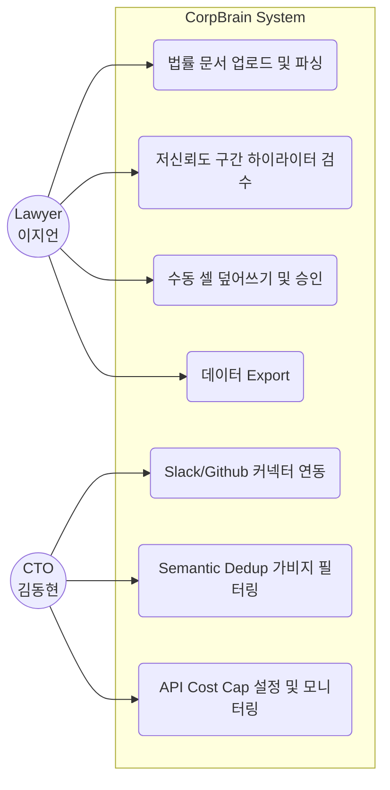
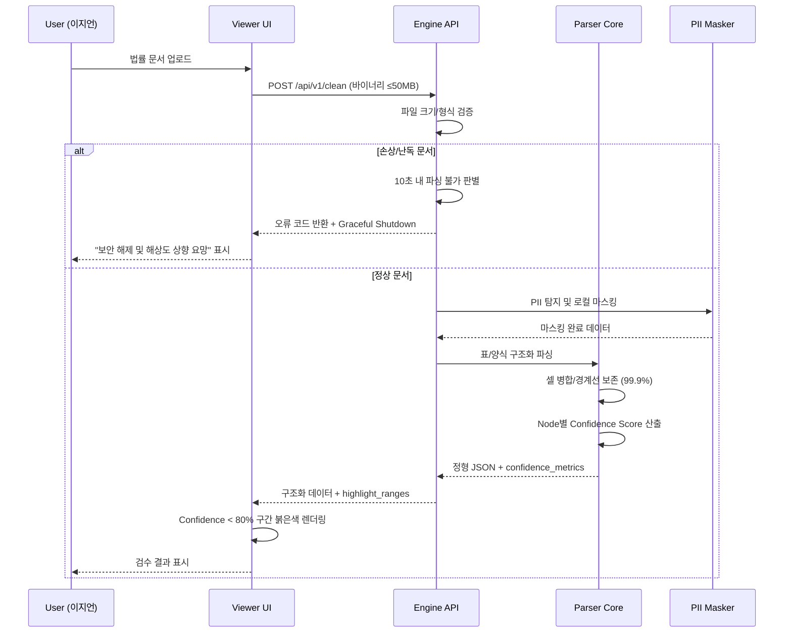
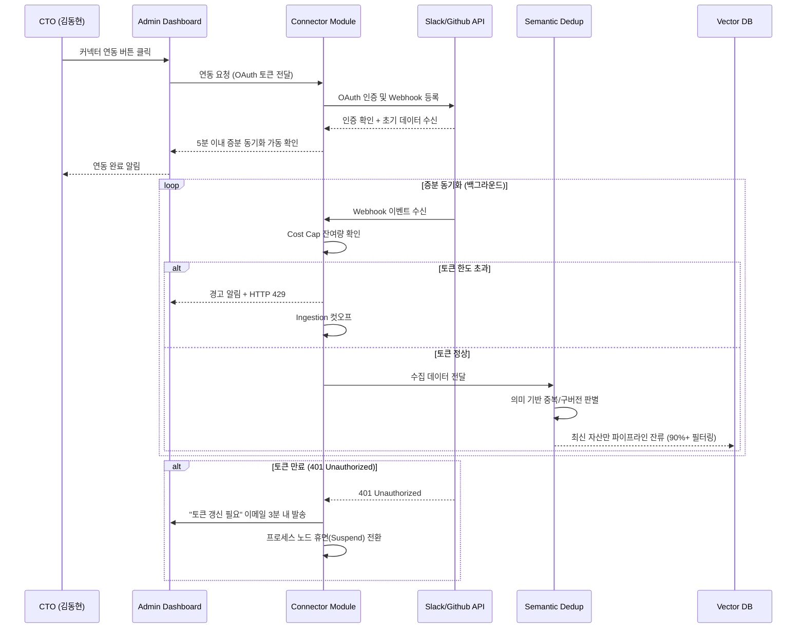
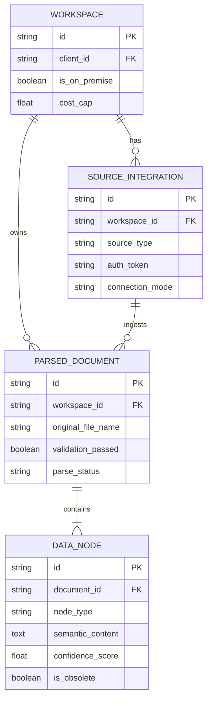
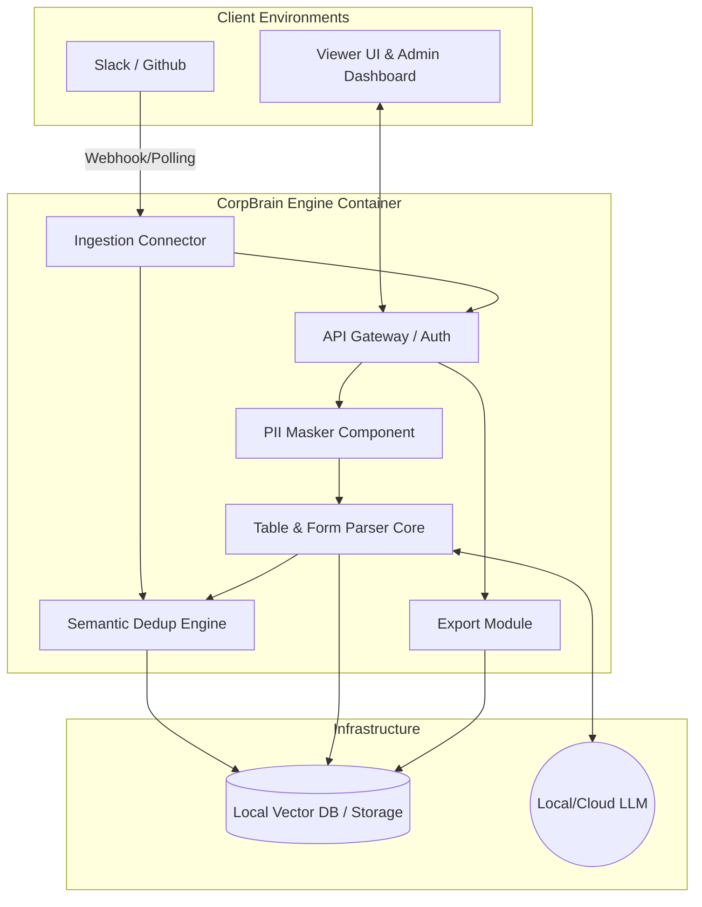
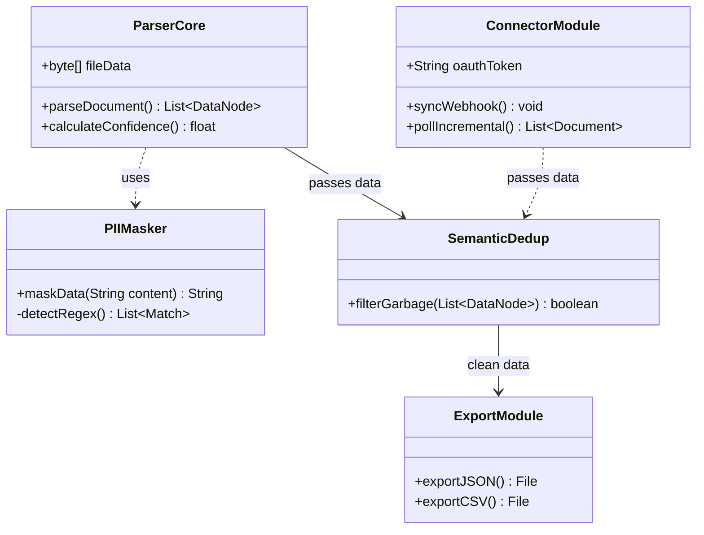
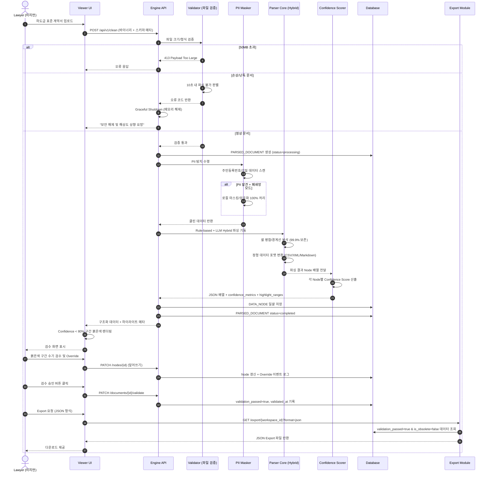

# Software Requirements Specification (SRS)
Document ID: SRS-001  
Revision: 0.2  
Date: 2026-04-22  
Standard: ISO/IEC/IEEE 29148:2018

---

## 1. Introduction

### 1.1 Purpose

본 SRS는 SME용 실시간 데이터 클리닝 OS 'CorpBrain'의 소프트웨어 요구사항을 ISO/IEC/IEEE 29148:2018 표준에 따라 정의한다.

**해결 대상 문제:**
- **Pain 1 (부티크 로펌)**: 복잡한 법률 서식(도표)의 파싱 붕괴 및 환각으로 인한 법률적 리스크 발생. 수작업 검수 시간 일 4시간 초과 건수 비중 80% 이상, 데이터 추출 오류율 5% 초과.
- **Pain 2 (기술 스타트업)**: 핵심 인력 퇴사로 인한 레거시 데이터 블랙박스화. 신규 입사자 온보딩 2주 이상 비율 70%, RAG 환각 사고 발생률 15% 초과.

### 1.2 Scope

**In-Scope:**
- SME용 로컬 폐쇄망 파서 엔진 (V0.2 PoC: A 법무법인 하도급 표준 계약서 1종 집중)
- Confidence Score 기반 저신뢰도 구간 하이라이터 UI
- 가비지 선별 로직 (Semantic Dedup)
- Slack/Github 단일 클릭 백그라운드 커넥터
- PII 오토 마스킹 컴플라이언스 모듈

**Out-of-Scope:**
- 비정형 문서 자동 기안/생성 에이전트
- 프론트엔드 자체 채팅 뷰어 (RAG 봇)
- 단독 SI 수주 기반 맞춤 개발
- 범용 음성/이미지 획득 모듈 (타이핑 불가 직무용)

### 1.3 Definitions, Acronyms, Abbreviations

| 용어 | 정의 |
|---|---|
| Confidence Score | AI 파싱 결과 확신도. 80% 미만 시 하이라이트 검수 대상 |
| Semantic Dedup | 의미 기반 중복 제거. 구버전/쓰레기 문서 자동 필터링 기술 |
| TEDS-Struct | Tree-Edit-Distance-based Metric. 자동 표 인식 벤치마크 지표 |
| PII | Personally Identifiable Information. 주민등록번호 등 개인 식별 정보 |
| JTBD | Jobs to be Done. 사용자가 완수해야 할 핵심 과업 |
| AOS | Adjusted Opportunity Score. 조정된 기회 점수 |
| DOS | Discovered Opportunity Score. 발견된 기회 점수 |
| MoSCoW | Must/Should/Could/Won't 우선순위 분류 체계 |
| Graceful Shutdown | 메모리 누수 없이 프로세스를 안전하게 종료하는 절차 |
| Cost Cap | 사용자 설정 월간 API 토큰 상한액 |
| Hybrid 배포 | PII는 로컬 처리, 비민감 데이터만 클라우드 LLM 활용하는 아키텍처 |

### 1.4 References

| ID | 출처 | 설명 |
|---|---|---|
| REF-01 | 가상 인터뷰 - 이지언 변호사 | "붉은색 표시만 리뷰하면 심리적 방어선 구축되어 즉시 도입함." 검수 체류시간 단축 KPI 및 하이라이터 AC 정당화 근거 |
| REF-02 | 가상 인터뷰 - 김동현 CTO | "과거 중복 기록 필터링 및 마찰 없는 백그라운드 연동 시 전사 풀계정 결제." Semantic Dedup 우선 개발 근거 |
| REF-03 | ADR-001 | 인프라 종속성을 끊는 컨테이너(Docker/K8s) 기반 플러그앤플레이 아키텍처 정책 |
| REF-04 | ADR-002 | LlamaParse 등 오픈소스 생태계 종속 회피를 위한 플러거블 패턴 채택 |
| REF-05 | PRD_CorpBrain v0.3 | 본 SRS의 유일한 비즈니스/기능 요구 원천 문서 |

### 1.5 Constraints and Assumptions

**Constraints (제약사항):**

| ID | 유형 | 제약 내용 | 완화 방안 | 출처 |
|---|---|---|---|---|
| CON-01 | 경쟁 리스크 | 오픈소스 파서 API 단가 하방 압력 평준화 | 폴더 자동 재구성 및 Semantic Dedup 고도화에 개발 집중 | PRD §7 |
| CON-02 | 기술 리스크 | 특수 양식 템플릿의 로펌별 Edge case 발생 우려 | 표준 계약서 10종 사전 학습, Rule-based + LLM Hybrid 패턴 적용 | PRD §7 |
| CON-03 | 비즈니스 리스크 | On-premise 영업 마찰 및 세팅 시간 오버헤드 | Docker/K8s 컨테이너 플러그앤플레이 제공 (REF-03) | PRD §7 |
| CON-04 | 보안 제약 | 완전 폐쇄망 고객사 아웃바운드 트래픽 0 Byte 강제 | Hybrid 배포 아키텍처 의무 적용 | PRD §5 |
| CON-05 | 기술 종속 | 특정 오픈소스 파서 생태계 락인 회피 필요 | 플러거블 패턴 채택 (REF-04) | PRD §7 |

**Assumptions (가정):**
- 고객사 내 별도 숙련 엔지니어 개입 없이 시스템 UI로 초기 세팅이 종결된다고 가정한다.
- 베타 대상 고객사가 표준 OAuth 인증 방식의 Slack/Github 환경을 사용한다고 가정한다.

---

## 2. Stakeholders

| Role | 이름/페르소나 | Responsibility | Interest |
|---|---|---|---|
| Core User 1 | 이지언 (부티크 특화 로펌 대표) | 법률 문서 실사, 파싱 결과물 최종 검수 및 법률적 리스크 통제 | 100% 로컬 보안 환경 내 표/양식 정밀 파싱, 저신뢰도 구간 시각화를 통한 수기 대조 시간 87.5% 단축 (일 4h → 30min) |
| Core User 2 | 김동현 (시리즈 B 기술 스타트업 CTO) | 사내 파편화 지식 중앙화, 신입 온보딩 리드 및 API 비용 관리 | 기존 Slack/Github 워크플로우 무변경 백그라운드 연동, 구버전 자동 차단으로 RAG 환각 억제 및 온보딩 1시간 이내 달성 |
| System Admin | 고객사 계정 담당자 | 시스템 모니터링, Cost Cap 설정, 토큰 갱신, 경보 수신 | 시스템 안정성 99.9% 확보 및 비용 초과 방지 |
| Product Owner | 다온 & 회비서 | 제품 방향성 결정, KPI 달성 추적, PoC 릴리즈 관리 | 북극성 KPI(파싱 성공률 99.9%) 달성 및 PMF 관문 통과 |

---

## 3. System Context and Interfaces

**[System Use Case Diagram]**


### 3.1 External Systems

| 시스템 | 유형 | 연동 방식 | 제약 |
|---|---|---|---|
| Slack | SaaS 메시징 | OAuth + Webhook (증분 동기화) | API Rate Limit 준수, 토큰 순환 리프레시 |
| Github | SaaS 코드 저장소 | OAuth + Webhook (증분 동기화) | API Rate Limit 준수, 토큰 순환 리프레시 |
| Notion | SaaS 문서 도구 | OAuth + Polling (Incremental ID) | Rate Limit 최적 우회 |
| 로컬 파일 시스템 | On-premise NAS | 직접 파일 마운트 | 폐쇄망 내부 전용 |
| 외부 클라우드 LLM | AI 추론 서비스 | REST API | PII 마스킹 후에만 전송 허용 (Hybrid 아키텍처) |
| Vector DB | 외부 RAG 파이프라인 | 구조화 Payload 전송 | Export 포맷 호환성 보장 |

### 3.2 Client Applications

| 애플리케이션 | 용도 |
|---|---|
| CorpBrain Viewer UI | 파싱 결과 열람, 붉은색 하이라이터 구간 확인, 셀 수동 덮어쓰기, 검수 승인 |
| CorpBrain Admin Dashboard | Cost Cap 설정, 시스템 모니터링, 토큰 잔여량 확인, 경보 알럿 관제 |

### 3.3 API Overview

| API | Method / Endpoint | Input | Output | 제약 |
|---|---|---|---|---|
| Connector (Ingestion) | `POST /webhook/ingest` | 외부 플랫폼 증분 데이터 Webhook Payload | 수신 확인 (ACK) | OAuth 토큰 유효성 검증, Rate Limit |
| Connector (Polling) | `GET /api/v1/sync?last_id={id}` | Incremental ID | 신규 변경 데이터 배열 | 증분 ID 기반 제한적 호출 |
| Engine (Clean) | `POST /api/v1/clean` | 바이너리 파일 (≤50MB) + 스키마 템플릿 메타 | 구조화 JSON 배열 + `{highlight_ranges, confidence_metrics}` | 파일 크기 50MB 제한 |
| Export | `GET /api/v1/export/{workspace_id}` | workspace_id, format 파라미터 | JSON / CSV / XML / Vector DB Payload | 검증 완료 데이터만 내보내기 |
| Token Control | `PUT /api/v1/workspace/{id}/cost-cap` | cost_cap 값 (float) | 설정 확인 응답 | 월간 단위 리셋 |
| Alert | `POST /api/v1/alerts/notify` | 알림 유형, 수신자, 메시지 | 발송 확인 | 3분 이내 전송 보장 |

### 3.4 Interaction Sequences (핵심 흐름)

**핵심 시퀀스 1: 문서 파싱 및 검수 흐름**



**핵심 시퀀스 2: 커넥터 연동 및 Dedup 흐름**



---

## 4. Specific Requirements

### 4.1 Functional Requirements

#### F1: 무결점 Table & Form Parser (Must Have)

| ID | Source | Priority | Description | Acceptance Criteria |
|---|---|---|---|---|
| REQ-FUNC-001 | Story 1 AC1 / F1 | Must | 시스템은 업로드된 법률 서식(표, 주석 포함)을 정형 데이터 포맷(CSV/XML/Markdown)으로 변환해야 한다. | **Given** 로펌 특화 양식이 업로드됨 **When** 로컬 클리닝 엔진 파싱 완료 시 **Then** 표 셀 병합과 경계선의 99.9%가 어긋남 없이 추출된다. |
| REQ-FUNC-002 | Story 1 AC1 / F1 | Must | 시스템은 업로드 파일의 크기를 50MB 이하로 제한하고, 초과 시 명시적 오류를 반환해야 한다. | **Given** 50MB 초과 파일 업로드 시 **When** API가 수신하면 **Then** 즉시 `413 Payload Too Large` 응답을 반환한다. |
| REQ-FUNC-003 | Story 1 AC4 / F1 | Must | 시스템은 암호화/50dpi 미만 손상 문서를 10초 내 판별하여 안전 종료해야 한다. | **Given** 손상/난독 문서 업로드 시 **When** 10초 내 정상 구조화 불가 판별 **Then** "보안 해제 및 원본 해상도 상향 요망" 오류 코드 반환 후 메모리 누수 없이 Graceful Shutdown 수행. |
| REQ-FUNC-004 | Story 1 AC3 / F1 | Must | 폐쇄망 모드에서 모든 파싱/렌더링 완료 시 아웃바운드 트래픽이 0 Byte여야 한다. | **Given** 완전 폐쇄망 설치 환경 **When** 파싱 및 렌더링 완료 시 **Then** 외부 클라우드 아웃바운드 통신 볼륨 = 0 Byte. |
| REQ-FUNC-005 | F1 (PoC) | Must | V0.2 첫 스프린트에서 'A 법무법인 하도급 표준 계약서 1종'의 완전 파싱을 1주 내 달성해야 한다. | **Given** A 법무법인 하도급 표준 계약서 입력 **When** 엔진 처리 시 **Then** 모든 표/양식이 정형 데이터로 100% 복원된 PoC 버전이 1주 내 릴리즈된다. |

#### F2: Confidence Score 에러 하이라이터 UI (Must Have, P1 후행 의존)

| ID | Source | Priority | Description | Acceptance Criteria |
|---|---|---|---|---|
| REQ-FUNC-006 | Story 1 AC2 / F2 | Must | 시스템은 파싱된 각 Data Node에 대해 0~100% 범위의 Confidence Score를 산출해야 한다. | **Given** 파싱 엔진이 Data Node를 생성할 때 **When** 구조화 완료 시 **Then** 각 Node에 float 타입 confidence_score가 할당된다. |
| REQ-FUNC-007 | Story 1 AC2 / F2 | Must | Viewer UI에서 Confidence 80% 미만 영역을 붉은색으로 즉시 하이라이트 표시해야 한다. | **Given** 추출 결과를 Viewer에서 열람 시 **When** confidence_score < 80% 감지 **Then** 해당 영역을 즉시 붉은색 하이라이트 렌더링. |
| REQ-FUNC-008 | F2 | Must | 검수자는 하이라이트된 셀 구조를 수동으로 덮어쓰기(Override) 할 수 있어야 한다. | **Given** 붉은색 하이라이트 영역 클릭 시 **When** 사용자가 수정 데이터 입력 **Then** 원본 Node 데이터가 사용자 입력값으로 갱신되고 덮어쓰기 이벤트 로그가 기록된다. |
| REQ-FUNC-009 | F2 | Must | 검수자는 문서 전체 검수를 완료하고 승인(validation_passed=true)할 수 있어야 한다. | **Given** 모든 하이라이트 구간 검토 완료 시 **When** 승인 버튼 클릭 **Then** PARSED_DOCUMENT.validation_passed = true로 갱신되고 Export 대기 상태 진입. |

#### F3: 가비지 선별 Semantic Dedup (Should Have, P1 일부 의존)

| ID | Source | Priority | Description | Acceptance Criteria |
|---|---|---|---|---|
| REQ-FUNC-010 | Story 2 AC2 / F3 | Should | 수집 파이프라인에서 의미 기반 중복 탐지를 수행하여 구버전/안내성 문건을 자동 배제해야 한다. | **Given** 파편화된 과거 문서 더미가 인입 시 **When** Semantic Dedup 처리 완료 **Then** 구버전 및 안내성 텍스트 90% 이상 자동 배제, 최신 자산만 잔류. |
| REQ-FUNC-011 | F3 | Should | 배제된 문서에 대해 DATA_NODE.is_obsolete = true를 설정하고 배제 사유 로그를 기록해야 한다. | **Given** Semantic Dedup이 문서를 배제 판정 시 **When** 해당 Node 처리 완료 **Then** is_obsolete=true 마킹 및 배제 사유(중복/구버전)가 로그에 기록된다. |
| REQ-FUNC-012 | F3 | Should | 관리자는 배제된 문서 목록을 조회하고 수동 복원할 수 있어야 한다. | **Given** Admin Dashboard에서 배제 문서 목록 조회 시 **When** 복원 버튼 클릭 **Then** is_obsolete=false로 변경되고 파이프라인에 재투입된다. |

#### F4: 단일 클릭 백그라운드 커넥터 (Should Have)

| ID | Source | Priority | Description | Acceptance Criteria |
|---|---|---|---|---|
| REQ-FUNC-013 | Story 2 AC1 / F4 | Should | 사용자가 연동 버튼 1회 클릭으로 Slack/Github/Notion 증분 동기화를 5분 내 백그라운드 가동해야 한다. | **Given** 기존 도구 환경에서 커넥터 연동 버튼 클릭 시 **When** OAuth 인증 완료 **Then** 5분 이내 증분 동기화 셋업 백그라운드 가동, UI 워크플로우 변경 0건. |
| REQ-FUNC-014 | Story 2 AC4 / F4 | Must | API 토큰 만료(401 Unauthorized) 시 3분 내 이메일 알림 발송 후 프로세스 휴면 전환해야 한다. | **Given** 연동된 API 토큰이 Invalid 상태 **When** 401 Unauthorized 수신 **Then** 담당자에게 3분 내 "토큰 갱신 필요" 이메일 발송 + 프로세스 노드 Suspend 모드 전환. |
| REQ-FUNC-015 | Story 2 AC3 / F4 | Must | 월 API 토큰 상한액(Cost Cap) 초과 시 즉시 호출을 100% 중단하고 경고 알림을 표시해야 한다. | **Given** 실시간 동기화 중 **When** Cost Cap 초과 콜 발생 **Then** 즉시 100% 호출 중단 + 경고 알림 표시. |
| REQ-FUNC-016 | F4 | Should | 커넥터는 Webhook 우선 채택하고, Webhook 불가 시 증분 ID 기반 Polling으로 자동 전환해야 한다. | **Given** 외부 플랫폼 연동 시 **When** Webhook 등록 실패 **Then** 자동으로 Incremental ID 기반 Polling 모드로 전환. |

#### F5: PII 오토 마스킹 컴플라이언스 (Could Have, P1 의존)

| ID | Source | Priority | Description | Acceptance Criteria |
|---|---|---|---|---|
| REQ-FUNC-017 | F5 | Could | 시스템은 문서 내 PII(주민등록번호, 기밀 데이터)를 자동 탐지해야 한다. | **Given** 문서 파싱 처리 중 **When** PII 패턴 감지 시 **Then** 탐지된 PII 항목 리스트와 위치 정보를 반환한다. |
| REQ-FUNC-018 | F5 / NFR 보안 | Could | 클라우드 LLM 전송 전 반드시 로컬 망에서 PII 마스킹/암호화를 100% 완료해야 한다. | **Given** 클라우드 LLM 전송 시그널 발생 전 **When** PII가 존재하는 데이터 처리 시 **Then** 로컬 망 내 마스킹/암호화 100% 완료 후에만 전송 허용. |

#### F6: 데이터 Export (Must Have)

| ID | Source | Priority | Description | Acceptance Criteria |
|---|---|---|---|---|
| REQ-FUNC-019 | PRD §6 Export API | Must | 검증 완료된 데이터를 JSON, CSV, XML, Vector DB Payload 형식으로 Export할 수 있어야 한다. | **Given** validation_passed=true인 문서에 대해 **When** Export 요청 시 **Then** 지정 포맷(JSON/CSV/XML/Vector DB Payload)으로 데이터 제공. |
| REQ-FUNC-020 | PRD §6 Export API | Must | Export 시 is_obsolete=true인 Data Node는 자동으로 제외해야 한다. | **Given** Export 실행 시 **When** 데이터 조회 **Then** is_obsolete=true인 Node는 결과에서 자동 배제. |


### 4.2 Non-Functional Requirements

#### Performance

| ID | Category | Description | Target Metric |
|---|---|---|---|
| REQ-NF-001 | Latency | 단일 문서 장당 파싱 완료 응답 시간 | p95 ≤ 1,500 ms |
| REQ-NF-002 | Throughput | 배치 파싱 시 증분 데이터(Delta) 수집 동기화 지연 | ≤ 3 minutes |
| REQ-NF-003 | Onboarding | 첫 파트너 툴 동기화 온보딩 소요 시간 | ≤ 1시간 (계정 생성 → 최초 HTTP 200 OK 수신 간 Delta) |

#### Availability & Reliability

| ID | Category | Description | Target Metric |
|---|---|---|---|
| REQ-NF-004 | SLA | 클리닝 파서 시스템 월간 가용성 | ≥ 99.9% |
| REQ-NF-005 | Error Rate | 문서 처리 중 엔진 크래시 및 오류율 (Parser Error Rate) | ≤ 0.1% |

#### Security

| ID | Category | Description | Target Metric |
|---|---|---|---|
| REQ-NF-006 | Network Isolation | 폐쇄망 모드 시 외부 아웃바운드 트래픽 | = 0 Byte |
| REQ-NF-007 | Data Protection | PII 데이터 클라우드 전송 전 로컬 마스킹/암호화 | 100% 완료 후에만 전송 허용 (Hybrid 배포 아키텍처) |

#### Cost

| ID | Category | Description | Target Metric |
|---|---|---|---|
| REQ-NF-008 | Opex 효율 | 로컬 구동 대비 기존 클라우드 OCR API 종량제 비용 | 사용 1주기(1년) 내 비용 80% 우위 보장 |
| REQ-NF-009 | Token Control | 사용자별 월 API 토큰 과금 캡(Cost Cap) 제어 | 잔여 15% 이하 시 경고 알림, 0% 도달 시 Ingestion 컷오프 + HTTP 429 응답 |
| REQ-NF-010 | Storage 절감 | Semantic Dedup 적용 후 LLM 토큰 비용 및 Vector DB 볼륨 유지비 절감 | ≥ 60% 절감 |

#### Monitoring & Alerting

| ID | Category | Description | Target Metric |
|---|---|---|---|
| REQ-NF-011 | OOM 방지 | 메모리 사용률 1.5GB 한도 90% 도달 또는 엔진 크래시 주 3회 발생 시 경보 | PagerDuty/Slack P1 채널로 1분 내 경보 발송 |
| REQ-NF-012 | Timeout 감시 | 전처리 중 타임아웃(2,000ms 지속 초과) 및 Confidence 80점 미만 비중 5% 이상 쏠림 시 | Admin 대시보드 적색 경고 Popup 등재 |
| REQ-NF-013 | Token 소모 감시 | 월간 토큰 제한치 대비 잔여율 15% 이하 진입 시 | 1차 계정자 경고 알림 전송 |

#### Effectiveness (북극성 KPI 연계)

| ID | Category | Description | Target Metric | 측정 방법 |
|---|---|---|---|---|
| REQ-NF-014 | 파싱 정확도 (북극성) | 무결점 포맷 보존 파싱 성공률 | Baseline 85% → Target 99.9% | 매주 금요일 / 벤치마크 세트(n=100) F1-Score + ElasticSearch 파싱 실패 로그 |
| REQ-NF-015 | 검수 효율 (보조 KPI 1) | 고객당 평균 수작업 대조 체류 시간 | Baseline 4h/일 → Target 30min 미만/일 | 월간 / Viewer 체류 시간 + 셀 덮어쓰기 클릭 추적 (Amplitude/Mixpanel) |
| REQ-NF-016 | 필터링률 (보조 KPI 2) | 쓰레기/구버전 문서 자동 필터링률 | Baseline 0% → Target 90% 이상 차단 | 주간 / Ingestion 진입 건수 대비 Dedup Drop 건수 비율 |
| REQ-NF-017 | 벤치마크 (TEDS-Struct) | 외부 타사 A API 대비 표 인식 성능 우위 | TEDS-Struct 점수 +25pt 우위 | 1,000건 Dirty Form Dataset 시뮬레이션, TEDS-Struct + F1-Score 동시 측정 |
| REQ-NF-018 | Cell Displacement | 표 내 요소 변위 에러율 | ≤ 10% (기존 대비 90% 감소) | 대안 클라우드 OCR API 대비 벤치마크 테스트 |

#### Scalability & Maintainability

| ID | Category | Description | Target Metric |
|---|---|---|---|
| REQ-NF-019 | Portability | 완전 컨테이너(Docker/K8s) 기반 배포로 인프라 종속성 제거 | 고객사 환경 무관 플러그앤플레이 설치 (REF-03) |
| REQ-NF-020 | Pluggability | 특정 오픈소스 파서 종속 없는 플러거블 아키텍처 | 파서 모듈 교체 시 시스템 중단 0건 (REF-04) |
| REQ-NF-021 | Template 확장 | Rule-based + LLM Hybrid 패턴으로 법률 서식 Edge case 방어 | 표준 계약서 10종 사전 학습 완료, 신규 템플릿 추가 시 재배포 불필요 |

---

## 5. Traceability Matrix

| Source (Story / Feature) | Requirement ID | NFR ID | Test Case Area |
|---|---|---|---|
| Story 1 AC1 (무결점 표 추출) | REQ-FUNC-001, REQ-FUNC-002 | REQ-NF-001, REQ-NF-014, REQ-NF-017, REQ-NF-018 | TC-001: 도표 파싱 정확도 및 셀 변위율 벤치마크 |
| Story 1 AC2 (Confidence 하이라이터) | REQ-FUNC-006, REQ-FUNC-007, REQ-FUNC-008, REQ-FUNC-009 | REQ-NF-015 | TC-002: 하이라이터 렌더링 검증 및 검수 시간 측정 |
| Story 1 AC3 (망분리 사수) | REQ-FUNC-004 | REQ-NF-006 | TC-003: 폐쇄망 아웃바운드 트래픽 0 Byte 감사 |
| Story 1 AC4 (손상 문서 방어) | REQ-FUNC-003 | REQ-NF-005 | TC-004: 손상/난독 문서 10초 내 안전 종료 확인 |
| Story 2 AC1 (무마찰 연동) | REQ-FUNC-013, REQ-FUNC-016 | REQ-NF-003 | TC-005: 커넥터 5분 내 동기화 가동 및 워크플로우 무변경 검증 |
| Story 2 AC2 (쓰레기 필터링) | REQ-FUNC-010, REQ-FUNC-011, REQ-FUNC-012 | REQ-NF-016, REQ-NF-010 | TC-006: Semantic Dedup 90% 이상 필터링률 측정 |
| Story 2 AC3 (API 과금 캡) | REQ-FUNC-015 | REQ-NF-009, REQ-NF-013 | TC-007: Cost Cap 초과 시 즉시 컷오프 및 HTTP 429 응답 검증 |
| Story 2 AC4 (토큰 만료 방어) | REQ-FUNC-014 | REQ-NF-011 | TC-008: 401 수신 시 3분 내 이메일 발송 및 Suspend 전환 검증 |
| F1 PoC (하도급 계약서) | REQ-FUNC-005 | REQ-NF-017 | TC-009: A 법무법인 하도급 표준 계약서 1종 완전 파싱 검증 |
| F5 (PII 마스킹) | REQ-FUNC-017, REQ-FUNC-018 | REQ-NF-007 | TC-010: PII 탐지율 및 마스킹 후 외부 전송 차단 검증 |
| F6 (Export) | REQ-FUNC-019, REQ-FUNC-020 | - | TC-011: JSON/CSV/XML/VectorDB Export 포맷 정합성 검증 |
| System Monitoring | - | REQ-NF-011, REQ-NF-012, REQ-NF-013 | TC-012: OOM/Timeout/Token 임계치 경보 발송 시간 측정 |
| Scalability | - | REQ-NF-019, REQ-NF-020, REQ-NF-021 | TC-013: 컨테이너 배포 및 파서 모듈 교체 무중단 검증 |

---

## 6. Appendix

### 6.1 API Endpoint List

| # | Method | Endpoint | 용도 | 인증 | 제약 |
|---|---|---|---|---|---|
| 1 | POST | `/webhook/ingest` | 외부 플랫폼 증분 데이터 Webhook 수신 | OAuth Token | Rate Limit 준수 |
| 2 | GET | `/api/v1/sync?last_id={id}` | 증분 데이터 Polling 수집 | OAuth Token | Incremental ID 기반 |
| 3 | POST | `/api/v1/clean` | 문서 바이너리 업로드 및 파싱 | API Key | Payload ≤ 50MB |
| 4 | GET | `/api/v1/export/{workspace_id}?format={fmt}` | 검증 완료 데이터 Export | API Key | validation_passed=true만 |
| 5 | PUT | `/api/v1/workspace/{id}/cost-cap` | 월간 토큰 상한액 설정 | Admin Auth | 월간 리셋 |
| 6 | POST | `/api/v1/alerts/notify` | 경보/알림 발송 | System Internal | 3분 내 전송 보장 |
| 7 | GET | `/api/v1/documents/{doc_id}/nodes` | 문서별 Data Node 조회 (Confidence 포함) | API Key | - |
| 8 | PATCH | `/api/v1/nodes/{node_id}` | 셀 구조 수동 덮어쓰기 (Override) | API Key | 덮어쓰기 이벤트 로그 기록 |
| 9 | PATCH | `/api/v1/documents/{doc_id}/validate` | 문서 검수 승인 (validation_passed=true) | API Key | 승인 후 Export 대기 |
| 10 | GET | `/api/v1/dedup/excluded?workspace_id={id}` | 배제 문서 목록 조회 | Admin Auth | - |
| 11 | PATCH | `/api/v1/nodes/{node_id}/restore` | 배제 문서 수동 복원 | Admin Auth | is_obsolete → false |

### 6.2 Entity & Data Model

#### ERD (Entity-Relationship Diagram)


#### WORKSPACE

| Field | Type | Constraint | Description |
|---|---|---|---|
| `id` | string | PK | 워크스페이스 고유 식별자 |
| `client_id` | string | FK, Not Null | 고객사 고유 식별자 |
| `is_on_premise` | boolean | Not Null, Default false | 완전 폐쇄망 로컬 구동 여부 |
| `cost_cap` | float | Default 0 | 월간 API 토큰 과금 상한액 |
| `created_at` | datetime | Not Null | 생성 시각 |
| `updated_at` | datetime | Not Null | 최종 수정 시각 |

#### SOURCE_INTEGRATION

| Field | Type | Constraint | Description |
|---|---|---|---|
| `id` | string | PK | 연동 소스 고유 식별자 |
| `workspace_id` | string | FK → WORKSPACE.id | 소속 워크스페이스 |
| `source_type` | enum | Not Null | Slack, Github, Notion, Local 중 택1 |
| `auth_token` | string | Encrypted, Not Null | OAuth 암호화 인증 토큰 |
| `connection_mode` | enum | Not Null | Webhook / Polling |
| `last_sync_time` | datetime | Nullable | 마지막 증분 동기화 성공 시각 |
| `status` | enum | Not Null, Default active | active / suspended / error |
| `created_at` | datetime | Not Null | 생성 시각 |

#### PARSED_DOCUMENT

| Field | Type | Constraint | Description |
|---|---|---|---|
| `id` | string | PK | 파싱 완료 문서 고유 식별자 |
| `workspace_id` | string | FK → WORKSPACE.id | 소속 워크스페이스 |
| `source_integration_id` | string | FK → SOURCE_INTEGRATION.id, Nullable | 인입 소스 (로컬 업로드 시 null) |
| `original_file_name` | string | Not Null | 원본 파일명 |
| `file_type` | string | Not Null | 원본 형식 (pdf, docx 등) |
| `file_size_bytes` | integer | Not Null | 원본 파일 크기 (bytes) |
| `validation_passed` | boolean | Not Null, Default false | 인간 검수 승인 완료 여부 |
| `parse_status` | enum | Not Null | pending / processing / completed / failed |
| `error_code` | string | Nullable | 파싱 실패 시 오류 코드 |
| `created_at` | datetime | Not Null | 업로드 시각 |
| `validated_at` | datetime | Nullable | 검수 승인 시각 |

#### DATA_NODE (Chunk)

| Field | Type | Constraint | Description |
|---|---|---|---|
| `id` | string | PK | 데이터 청크 고유 식별자 |
| `document_id` | string | FK → PARSED_DOCUMENT.id | 소속 문서 |
| `node_type` | enum | Not Null | Table, Text, Form 중 택1 |
| `semantic_content` | text | Not Null | 추출된 핵심 의미 데이터 |
| `confidence_score` | float | Not Null | 파싱 확신도 (0.0~1.0, 80% 미만 시 하이라이트) |
| `is_obsolete` | boolean | Not Null, Default false | Semantic Dedup 배제 여부 |
| `obsolete_reason` | string | Nullable | 배제 사유 (duplicate / outdated) |
| `highlight_ranges` | jsonb | Nullable | 하이라이트 대상 위치 정보 배열 |
| `overridden_by` | string | Nullable | 수동 덮어쓰기 수행자 ID |
| `overridden_at` | datetime | Nullable | 수동 덮어쓰기 시각 |
| `created_at` | datetime | Not Null | 생성 시각 |

### 6.3 System Architecture Diagrams

#### Component Diagram


#### Class Diagram (Core Modules)


### 6.4 Detailed Interaction Models

**상세 시퀀스 1: 문서 업로드 → 파싱 → 검수 → Export 전체 흐름**



**상세 시퀀스 2: 커넥터 연동 → 증분 동기화 → Dedup → 비용 제어 전체 흐름**

```mermaid
sequenceDiagram
    autonumber
    actor CTO as CTO (김동현)
    participant AD as Admin Dashboard
    participant CON as Connector Module
    participant EXT as Slack/Github API
    participant CAP as Cost Cap Controller
    participant DDP as Semantic Dedup Engine
    participant DB as Database
    participant ALT as Alert Service

    CTO->>AD: Slack 커넥터 연동 버튼 클릭
    AD->>CON: 연동 요청 (source_type=Slack)
    CON->>EXT: OAuth 인증 요청
    EXT-->>CON: 인증 성공 + Access Token
    CON->>DB: SOURCE_INTEGRATION 생성 (status=active, mode=Webhook)
    CON->>EXT: Webhook 등록 시도
    alt Webhook 등록 실패
        CON->>DB: connection_mode=Polling 전환
        CON->>CON: Incremental ID 기반 Polling 모드 가동
    else Webhook 등록 성공
        EXT-->>CON: Webhook 확인
    end
    CON-->>AD: 5분 이내 동기화 가동 완료
    AD-->>CTO: 연동 완료 알림

    rect rgb(240,248,255)
        Note over EXT,DB: 백그라운드 증분 동기화 루프
        EXT->>CON: Webhook 이벤트 (신규 데이터)
        CON->>CAP: 토큰 잔여량 확인
        alt 잔여 ≤ 15%
            CAP->>ALT: 1차 경고 알림 발송
            ALT-->>CTO: 토큰 잔여 15% 이하 경고 이메일
        end
        alt 잔여 = 0% (한도 초과)
            CAP->>CON: Ingestion 컷오프 명령
            CON-->>EXT: HTTP 429 Too Many Requests
            CAP->>ALT: 컷오프 알림 발송
        else 정상 범위
            CON->>DDP: 수집 데이터 전달
            DDP->>DDP: 의미 기반 중복/구버전 판별
            alt 구버전/중복 판정
                DDP->>DB: DATA_NODE 저장 (is_obsolete=true, reason 기록)
            else 최신 자산
                DDP->>DB: DATA_NODE 저장 (is_obsolete=false)
            end
        end
    end

    rect rgb(255,240,240)
        Note over EXT,ALT: 토큰 만료 예외 처리
        EXT-->>CON: 401 Unauthorized
        CON->>ALT: "토큰 갱신 필요" 알림 트리거
        ALT-->>CTO: 이메일 발송 (3분 내)
        CON->>DB: SOURCE_INTEGRATION status=suspended
    end
```

### 6.5 Validation Plan (검증 계획)

| # | 검증 항목 | 대상 | 환경 | 성공 기준 | 관련 요구사항 |
|---|---|---|---|---|---|
| VP-01 | TEDS-Struct 벤치마크 | Parser Core | 1,000건 Dirty Form Dataset | 외부 타사 A API 대비 +25pt 우위 | REQ-NF-017 |
| VP-02 | 로펌 UI 전환 효율 가설 | Viewer UI (하이라이터) | Closed Beta (로펌 3개사, 2~4주) | 검수 처리 시간 80% 감소 + 만족도 4.5/5.0 초과 | REQ-NF-015, REQ-FUNC-007 |
| VP-03 | RAG 신뢰 방어 가설 | Semantic Dedup | A/B 테스트 (스타트업 5개사) | 구버전 레퍼런스 잘못 참조 빈도 < 5% | REQ-NF-016, REQ-FUNC-010 |
| VP-04 | PoC 파싱 성공 | Parser Core | A 법무법인 하도급 표준 계약서 1종 | 1주 내 완전 파싱 성공 릴리즈 | REQ-FUNC-005 |

---

*— End of Document —*
