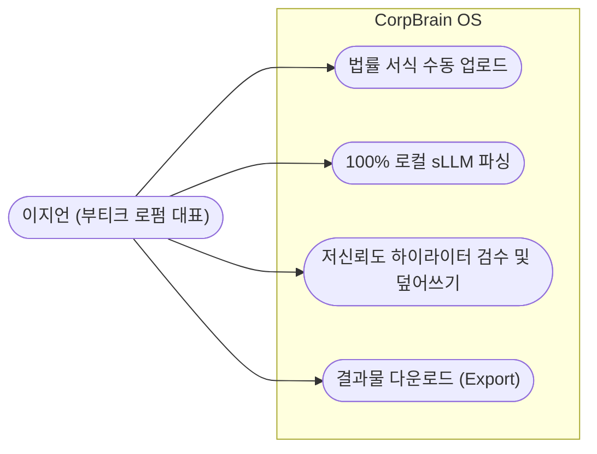
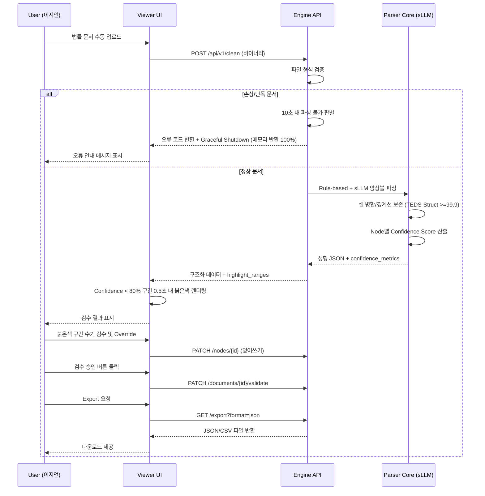
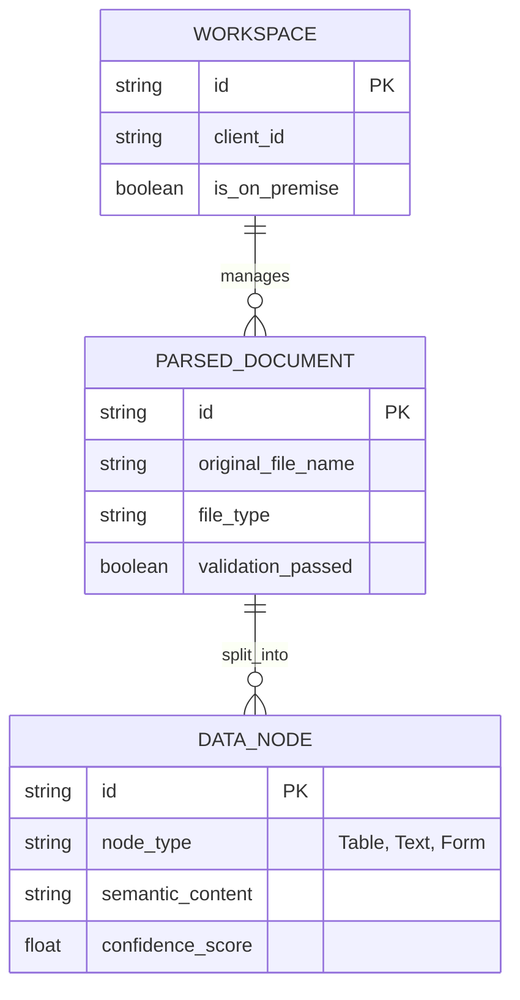
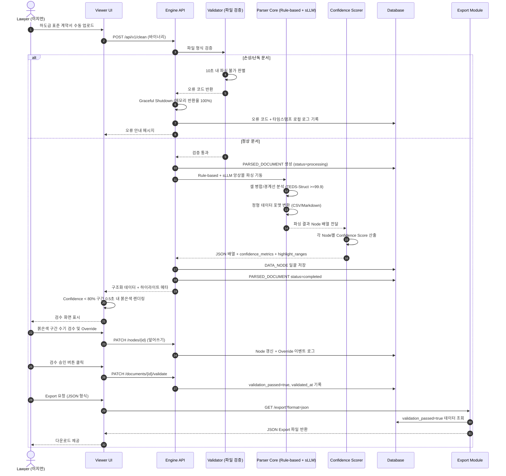
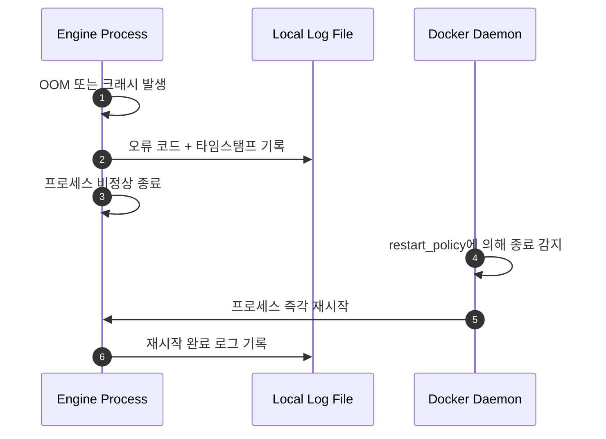
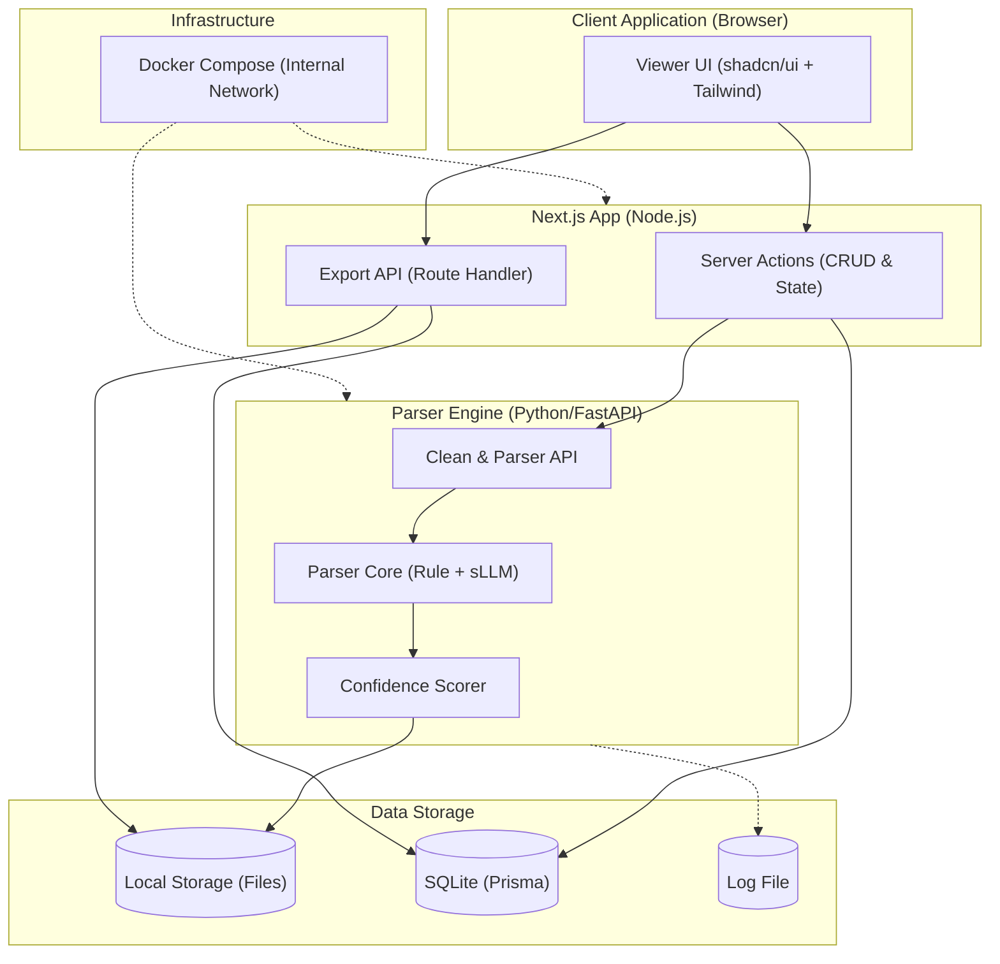
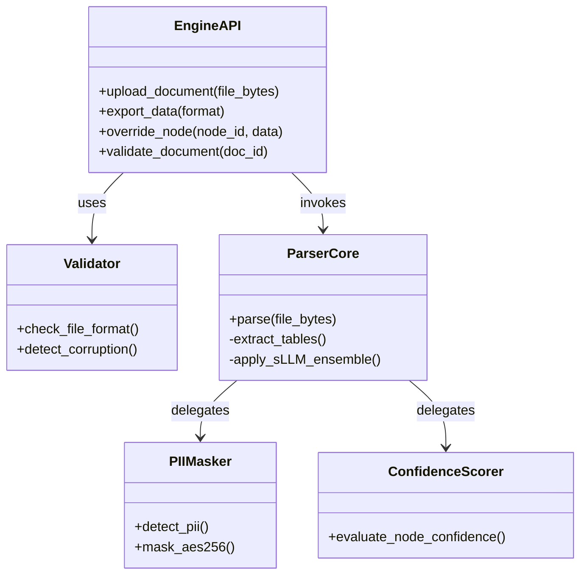

# Software Requirements Specification (SRS)
Document ID: SRS-001  
Revision: 1.0
Date: 2026-04-23  
Standard: ISO/IEC/IEEE 29148:2018

---

## 1. Introduction

### 1.1 Purpose

본 SRS는 SME용 실시간 데이터 클리닝 OS **CorpBrain**의 Lean MVP 소프트웨어 요구사항을 ISO/IEC/IEEE 29148:2018 표준에 따라 정의한다.

**해결 대상 문제:**
- **[Pain 1 — 부티크 로펌]**: 복잡한 법률 서식(도표)의 파싱 붕괴 및 환각 발생. 수작업 검수·대조 시간 일 4시간 초과 건수 비중 80% 이상, 데이터 추출/표기 오류율 5% 초과.

**목표:**
- 사용자의 수작업 문서 검수 시간 극단적 단축 (일 4h → 30min 이내, 87.5%↓).
- 표/특수 양식 환각 및 문서 오표기 0건(0%) 달성.
- 외부 API/클라우드 의존성 0%, 100% 로컬 LLM 구동을 통한 사내망/망분리 완전 준수.

### 1.2 Scope

**In-Scope:**
- 로컬 폐쇄망 파서 엔진 (V0.2 PoC: A 법무법인 하도급 표준 계약서 1종 집중)
- 수동 파일 업로드 인터페이스
- Confidence Score 기반 저신뢰도 구간 하이라이터 UI (0.5초 이내 렌더링)
- CSV/JSON 내보내기 (Export)
- PII 오토 마스킹 컴플라이언스 모듈 (리소스 여유 시, Could Have)
- 단일 Docker Compose 기반 온프레미스 배포

**Out-of-Scope:**
- Slack/Github/Notion 등 타사 API 연동 커넥터 (V0.7 이후)
- 로컬 임베딩 기반 Semantic Dedup (V0.7 이후)
- K8s 기반 오토 스케일링 배포 (V0.7 이후)
- 외부 경보 발송 시스템 (PagerDuty 등)
- 비정형 문서 자동 기안/생성 에이전트
- 클라우드/Hybrid 배포 모델 (전면 배제)
- 김동현 CTO 페르소나 관련 자동화·필터링 기능 (V0.7 이후)

### 1.3 Definitions, Acronyms, Abbreviations

| 용어 | 정의 |
|---|---|
| Confidence Score | AI 파싱 결과 확신도. 80% 미만 시 하이라이트 검수 대상 |
| TEDS-Struct | Tree-Edit-Distance-based Metric. 자동 표 인식 벤치마크 지표 (99.9점 이상 목표) |
| PII | Personally Identifiable Information. 주민등록번호 등 개인 식별 정보 |
| sLLM | Small/Local LLM. 사내 폐쇄망에서 구동되는 경량 언어 모델 |
| JTBD | Jobs to be Done. 사용자가 완수해야 할 핵심 과업 |
| AOS / DOS | Adjusted / Discovered Opportunity Score. 기회 점수 |
| MoSCoW | Must/Should/Could/Won't 우선순위 분류 체계 |
| Graceful Shutdown | 메모리 반환율 100%를 보장하며 프로세스를 안전 종료하는 절차 |
| Docker Compose | 단일 서버 환경에서 멀티컨테이너 오케스트레이션을 위한 경량 배포 도구 |
| Validator | 검증자. 파싱 결과를 인간이 최종 검수·승인하는 역할 |

### 1.4 References

| ID | 출처 | 설명 |
|---|---|---|
| REF-01 | 가상 인터뷰 — 이지언 변호사 | "붉은색 표시만 리뷰하면 심리적 방어선 구축되어 즉시 도입함." 검수 체류시간 단축 KPI 정당화 근거 |
| REF-02 | ADR-001 | Docker Compose 기반 단일 서버 플러그앤플레이 배포 정책 |
| REF-03 | ADR-002 | LlamaParse 등 오픈소스 생태계 종속 회피를 위한 플러거블 패턴 채택 |
| REF-04 | PRD_CorpBrain v0.6 Lean MVP | 본 SRS의 유일한 비즈니스/기능 요구 원천 문서 |
| REF-05 | KISA 개인정보 비식별 가이드라인 | PII 오토 마스킹 탐지율 99% 이상 기준 근거 |

### 1.5 Constraints and Assumptions

**Constraints (제약사항):**

| ID | 유형 | 제약 내용 | 완화 방안 | 출처 |
|---|---|---|---|---|
| CON-01 | 기술 리스크 | 특수 양식 템플릿의 로펌별 Edge case 발생 우려 | MVP에서 오직 'A 법무법인 하도급 표준 계약서 1종'에만 맞춤화, 성공 시 수평 확장 | PRD §7 |
| CON-02 | 보안 제약 | 100% 온프레미스 강제 — 외부 클라우드/상용 LLM API 전송 전면 금지 | 사내 폐쇄망 로컬 sLLM + 파서 엔진으로만 구동, 아웃바운드 0 Byte | PRD §5 |
| CON-03 | 인프라 제약 | K8s 클러스터링 배제, 단일 Docker Compose로 배포 구조 극도 단순화 | 고객사 단일 서버(로컬)에서 구동 가능한 패키징 | PRD §5 |
| CON-04 | 모니터링 제약 | PagerDuty 연동 및 실시간 Alert 자동화 삭제 | 엔진 크래시/OOM 시 로컬 로그 파일 + Docker restart_policy로 대체 | PRD §5 |
| CON-05 | 기술 종속 | 특정 오픈소스 파서 생태계 락인 회피 필요 | 플러거블 패턴 채택 (REF-03) | PRD §7 |

**Technical Constraints (기술 스택 제약사항):**

| ID | 유형 | 제약 내용 | 사유 및 출처 |
|---|---|---|---|
| C-TEC-001 | Framework | 프론트엔드 및 일반 서버 로직은 Next.js (App Router) 기반으로 구현한다. | 인프라 단순화 및 바이브코딩(AI) 개발 속도 극대화 |
| C-TEC-002 | Server Logic | 일반 DB 입출력은 Next.js Server Actions로 처리하되, **핵심 파서 엔진은 FastAPI(Python) 독립 컨테이너로 분리**한다. | 파이썬 머신러닝 생태계 연동 및 개발자(기획자) 역량 극대화 |
| C-TEC-003 | Database | 개발 및 배포 환경 모두 Prisma + 로컬 SQLite를 사용하여 클라우드 DB 연동을 원천 차단한다. | 100% 로컬 망분리(아웃바운드 0 Byte) 규정 준수 및 백업 용이성 확보 |
| C-TEC-004 | UI / Styling | UI 및 스타일링은 Tailwind CSS와 shadcn/ui를 사용하여 구현한다. | AI 코딩 어시스턴트의 일관된 디자인 코드 생성 강제 |

**Assumptions (가정):**
- 고객사 온프레미스 서버가 sLLM 구동에 필요한 최소 GPU/메모리 사양을 충족한다.
- MVP 대상 고객사는 A 법무법인 단일 타겟이며, 하도급 표준 계약서 1종으로 검증 범위를 한정한다.
- 문서 인입은 수동 파일 업로드로만 수행되며, 자동 커넥터 연동은 없다.

---

## 2. Stakeholders

| Role | 이름/페르소나 | Responsibility | Interest |
|---|---|---|---|
| Core User 1 | 이지언 (부티크 특화 로펌 대표) | 법률 문서 실사, 파싱 결과물 최종 검수 및 법률적 리스크 통제 | 100% 로컬 보안 환경 내 표/양식 정밀 파싱, 저신뢰도 구간 시각화를 통한 수기 대조 시간 87.5% 단축 (일 4h → 30min) |
| Product Owner | 다온 & 회비서 | 제품 방향성 결정, KPI 달성 추적, PoC 릴리즈 관리 | 북극성 KPI(파싱 성공률 99.9%) 달성 및 PMF 관문 통과 |

*(※ 김동현 CTO 페르소나는 V0.7 이후 연기)*

---

## 3. System Context and Interfaces

### 3.0 Use Case Diagram

### 3.1 External Systems

| 시스템 | 유형 | 연동 방식 | 제약 |
|---|---|---|---|
| 로컬 파일 시스템 | On-premise | 수동 파일 업로드 | 폐쇄망 내부 전용 |
| 로컬 sLLM | 사내 AI 추론 엔진 | 내부 gRPC/REST | 폐쇄망 전용, 외부 전송 0 Byte |

### 3.2 Client Applications

| 애플리케이션 | 용도 |
|---|---|
| CorpBrain Viewer UI | 파싱 결과 열람, 붉은색 하이라이터 구간 확인(0.5초 이내 렌더링), 셀 수동 덮어쓰기, 검수 승인 |

### 3.3 API Overview

| API | Method / Endpoint | Input | Output | 제약 |
|---|---|---|---|---|
| Engine (Clean) | `POST /api/v1/clean` | 바이너리 파일 업로드 | 구조화 JSON + `highlight_ranges` + `confidence_metrics` | 수동 업로드 전용 |
| Export | `GET /api/v1/export` | format 파라미터 (JSON/CSV) | JSON / CSV 포맷 다운로드 | validation_passed=true만 |
| Node Override | `PATCH /api/v1/nodes/{node_id}` | 수정 데이터 | 갱신 확인 + 이벤트 로그 | 덮어쓰기 이력 기록 |
| Doc Validate | `PATCH /api/v1/documents/{doc_id}/validate` | - | validation_passed=true 확인 | 승인 후 Export 대기 |

### 3.4 Interaction Sequences (핵심 흐름)

**핵심 시퀀스: 문서 수동 업로드 → 파싱 → 하이라이트 검수 → Export**

---

## 4. Specific Requirements

### 4.1 Functional Requirements

#### F1: 무결점 Table & Form Parser (Must Have)

| ID | Source | Priority | Description | Acceptance Criteria |
|---|---|---|---|---|
| REQ-FUNC-001 | Story 1 AC1 / F1 | Must | 시스템은 업로드된 법률 서식(표, 주석 포함)을 정형 데이터 포맷(CSV/XML/Markdown)으로 변환해야 한다. | **Given** 로펌 특화 양식 업로드 **When** 로컬 sLLM 파싱 완료 시 **Then** TEDS-Struct Score 99.9점 이상 달성, 정형 데이터 추출. |
| REQ-FUNC-002 | Story 1 AC1 / F1 | Must | 표 내 요소 변위 에러율을 기존 대안 클라우드 OCR API 대비 10% 이하로 보장해야 한다. | **Given** 벤치마크 테스트 수행 시 **When** 대안 OCR API와 비교 **Then** 변위 에러율 10% 이하(90% 감소). |
| REQ-FUNC-003 | Story 1 AC4 / F1 | Must | 손상 문서를 10초 내 판별하여 안전 종료해야 한다. | **Given** 손상 문서 업로드 **When** 10초 내 구조화 불가 판별 **Then** Graceful Shutdown, 메모리 반환율 100%. |
| REQ-FUNC-004 | Story 1 AC3 / F1 | Must | 모든 파싱/렌더링 완료 시 아웃바운드 트래픽 0 Byte 보장. | **Given** 온프레미스 환경 **When** 파싱·렌더링 완료 **Then** 외부 아웃바운드 = 0 Byte. |
| REQ-FUNC-005 | F1 (PoC) | Must | 'A 법무법인 하도급 표준 계약서 1종' 완전 파싱을 1주 내 달성. | **Given** 해당 계약서 입력 **When** 엔진 처리 **Then** 모든 표/양식 100% 복원 PoC 1주 내 릴리즈. |

#### F2: Confidence Score 에러 하이라이터 UI (Must Have, P1 후행 의존)

| ID | Source | Priority | Description | Acceptance Criteria |
|---|---|---|---|---|
| REQ-FUNC-006 | Story 1 AC2 / F2 | Must | 각 Data Node에 0~100% Confidence Score를 산출. | **Given** Data Node 생성 **When** 구조화 완료 **Then** float 타입 confidence_score 할당. |
| REQ-FUNC-007 | Story 1 AC2 / F2 | Must | Confidence 80% 미만 영역을 0.5초 이내 붉은색 하이라이트. | **Given** Viewer 열람 **When** confidence_score < 80% **Then** 0.5초 내 붉은색 렌더링. |
| REQ-FUNC-008 | F2 | Must | 하이라이트 셀 수동 덮어쓰기(Override) 기능. | **Given** 붉은색 영역 클릭 **When** 수정 입력 **Then** Node 갱신 + Override 이벤트 로그. |
| REQ-FUNC-009 | F2 | Must | 문서 전체 검수 승인(validation_passed=true). | **Given** 검토 완료 **When** 승인 버튼 클릭 **Then** validation_passed=true, Export 대기. |

#### F3: PII 오토 마스킹 (Could Have, P1 의존)

| ID | Source | Priority | Description | Acceptance Criteria |
|---|---|---|---|---|
| REQ-FUNC-010 | F3 / PRD §4 | Could | KISA 기준 PII 자동 탐지율 99% 이상 보장. | **Given** 파싱 처리 중 **When** PII 패턴 감지 **Then** 탐지율 99%+, PII 위치 반환. |
| REQ-FUNC-011 | F3 | Could | AES-256 PII 마스킹 문서당 100ms 이내. | **Given** PII 존재 시 **When** 마스킹 트리거 **Then** AES-256 적용, ≤100ms. |

#### F4: 데이터 Export (Must Have)

| ID | Source | Priority | Description | Acceptance Criteria |
|---|---|---|---|---|
| REQ-FUNC-012 | PRD §6 | Must | 검증 완료 데이터를 JSON/CSV로 Export. | **Given** validation_passed=true **When** Export 요청 **Then** 지정 포맷 제공. |
| REQ-FUNC-013 | PRD §6 | Must | Export 대상은 validation_passed=true만 허용. | **Given** Export 실행 **When** 데이터 조회 **Then** 미승인 문서 자동 배제. |

#### F5: 로컬 로그 기반 오류 복구 (Must Have)

| ID | Source | Priority | Description | Acceptance Criteria |
|---|---|---|---|---|
| REQ-FUNC-014 | PRD §5 | Must | 크래시/OOM 시 오류 코드를 로컬 로그 파일에 기록. | **Given** 크래시/OOM **When** 이벤트 감지 **Then** 오류 코드+타임스탬프 로그 기록. |
| REQ-FUNC-015 | PRD §5 | Must | Docker restart_policy에 의해 즉각 재시작. | **Given** 프로세스 비정상 종료 **When** Docker 감지 **Then** 즉각 재시작. |

---

### 4.2 Non-Functional Requirements

#### Performance

| ID | Category | Description | Target Metric |
|---|---|---|---|
| REQ-NF-001 | Latency | 단일 문서 장당 파싱 완료 응답 시간 (A4 1장/300dpi/텍스트+표 혼합 기준) | p95 ≤ 1,500 ms |
| REQ-NF-002 | UI Responsiveness | Confidence 80% 미만 구간 하이라이트 렌더링 지연 | ≤ 0.5초 (500ms) |

#### Availability & Reliability

| ID | Category | Description | Target Metric |
|---|---|---|---|
| REQ-NF-003 | Error Rate | 문서 처리 중 엔진 크래시 및 오류율 (Parser Error Rate) | ≤ 0.1% |
| REQ-NF-004 | Memory Safety | Graceful Shutdown 시 할당 메모리 반환율 | = 100% |
| REQ-NF-005 | Recovery | 엔진 크래시 후 Docker restart_policy에 의한 자동 복구 | 프로세스 즉각 재시작 보장 |

#### Security

| ID | Category | Description | Target Metric |
|---|---|---|---|
| REQ-NF-006 | Network Isolation | 100% 온프레미스 — 외부 아웃바운드 트래픽 | = 0 Byte (어떤 경우에도 외부 전송 금지) |
| REQ-NF-007 | PII Encryption | PII 데이터 AES-256 마스킹/암호화 처리 지연 (Could Have) | ≤ 100ms / 문서 |
| REQ-NF-008 | PII Detection | KISA 가이드라인 기준 PII 자동 탐지율 (Could Have) | ≥ 99% |

#### Deployment

| ID | Category | Description | Target Metric |
|---|---|---|---|
| REQ-NF-009 | Infrastructure | 단일 Docker Compose 기반 배포 — K8s 클러스터링 배제 | 고객사 단일 서버에서 구동 가능 |
| REQ-NF-010 | Pluggability | 특정 오픈소스 파서 종속 없는 플러거블 아키텍처 | 파서 모듈 교체 시 시스템 중단 0건 (REF-03) |
| REQ-NF-017 | Tech Stack | Next.js(App Router), FastAPI(Python), SQLite, Tailwind 스택으로 고정 | 기술 스택 제약(C-TEC) 준수 |

#### Monitoring (로컬 최소화 기준)

| ID | Category | Description | Target Metric |
|---|---|---|---|
| REQ-NF-011 | Error Logging | 엔진 크래시/OOM 발생 시 로컬 로그 파일에 오류 코드 기록 | 이벤트 발생 즉시 기록 |
| REQ-NF-012 | Auto Recovery | Docker restart_policy에 의한 프로세스 자동 재시작 | 비정상 종료 후 즉각 재시작 |

#### Effectiveness (북극성 KPI 연계)

| ID | Category | Description | Target Metric | 측정 방법 |
|---|---|---|---|---|
| REQ-NF-013 | 파싱 정확도 (북극성) | 무결점 포맷 보존 파싱 성공률 | Baseline 85% → Target 99.9% | 매주 금요일 / 벤치마크 세트(n=100) F1-Score + 파싱 실패 로그 |
| REQ-NF-014 | 검수 효율 (보조 KPI 1) | 고객당 평균 수작업 대조 체류 시간 | Baseline 4h/일 → Target 30min 미만/일 | 월간 / Viewer 체류 시간 + 셀 덮어쓰기 클릭 추적 |
| REQ-NF-015 | 벤치마크 (TEDS-Struct) | 외부 타사 A API 대비 표 인식 성능 우위 | TEDS-Struct 점수 +25pt 우위 | 1,000건 Dirty Form Dataset 동시 측정 |
| REQ-NF-016 | Cell Displacement | 표 내 요소 변위 에러율 | ≤ 10% (기존 대비 90% 감소) | 대안 클라우드 OCR API 대비 벤치마크 |

---

## 5. Traceability Matrix

| Source (Story / Feature) | Requirement ID | NFR ID | Test Case Area |
|---|---|---|---|
| Story 1 AC1 (무결점 표 추출, TEDS-Struct ≥99.9) | REQ-FUNC-001, REQ-FUNC-002, REQ-FUNC-005 | REQ-NF-001, REQ-NF-013, REQ-NF-015, REQ-NF-016 | TC-001: TEDS-Struct 점수 및 셀 변위율 벤치마크 |
| Story 1 AC2 (Confidence 하이라이터, 0.5초 렌더링) | REQ-FUNC-006, REQ-FUNC-007, REQ-FUNC-008, REQ-FUNC-009 | REQ-NF-002, REQ-NF-014 | TC-002: 하이라이터 0.5초 렌더링 검증 및 검수 시간 측정 |
| Story 1 AC3 (망분리 사수, 100% 온프레미스) | REQ-FUNC-004 | REQ-NF-006 | TC-003: 아웃바운드 트래픽 0 Byte 감사 |
| Story 1 AC4 (손상 문서 방어, 메모리 반환 100%) | REQ-FUNC-003 | REQ-NF-003, REQ-NF-004 | TC-004: 10초 내 안전 종료 및 메모리 반환율 100% 확인 |
| F1 PoC (하도급 계약서 1종) | REQ-FUNC-005 | REQ-NF-015 | TC-005: 하도급 표준 계약서 1종 완전 파싱 검증 |
| F2 (하이라이터 UI) | REQ-FUNC-006~009 | REQ-NF-002 | TC-006: Confidence 기반 하이라이트 및 Override 검증 |
| F3 (PII 마스킹, Could Have) | REQ-FUNC-010, REQ-FUNC-011 | REQ-NF-007, REQ-NF-008 | TC-007: KISA 탐지율 99% 및 AES-256 ≤100ms 처리 검증 |
| F4 (Export) | REQ-FUNC-012, REQ-FUNC-013 | - | TC-008: JSON/CSV Export 포맷 정합성 검증 |
| F5 (로컬 로그/복구) | REQ-FUNC-014, REQ-FUNC-015 | REQ-NF-011, REQ-NF-012 | TC-009: 크래시 로그 기록 및 Docker 자동 재시작 검증 |
| Infrastructure | - | REQ-NF-009, REQ-NF-010 | TC-010: Docker Compose 배포 및 플러거블 파서 교체 검증 |

---

## 6. Appendix

### 6.1 API Endpoint List

| # | Method | Endpoint | 용도 | 제약 |
|---|---|---|---|---|
| 1 | POST | `/api/v1/clean` | 문서 바이너리 수동 업로드 및 파싱 | 수동 업로드 전용 |
| 2 | GET | `/api/v1/export?format={fmt}` | 검증 완료 데이터 Export (JSON/CSV) | validation_passed=true만 |
| 3 | GET | `/api/v1/documents/{doc_id}/nodes` | 문서별 Data Node 조회 (Confidence 포함) | - |
| 4 | PATCH | `/api/v1/nodes/{node_id}` | 셀 구조 수동 덮어쓰기 (Override) | 덮어쓰기 이벤트 로그 기록 |
| 5 | PATCH | `/api/v1/documents/{doc_id}/validate` | 문서 검수 승인 (validation_passed=true) | 승인 후 Export 대기 |

### 6.2 Entity & Data Model

#### ERD (Entity-Relationship Diagram)

#### WORKSPACE

| Field | Type | Constraint | Description |
|---|---|---|---|
| `id` | string | PK | 워크스페이스 고유 식별자 |
| `client_id` | string | Not Null | 고객사 고유 식별자 |
| `is_on_premise` | boolean | Not Null, Default true | 온프레미스 구동 여부 (Lean MVP: 항상 true) |
| `created_at` | datetime | Not Null | 생성 시각 |
| `updated_at` | datetime | Not Null | 최종 수정 시각 |

#### PARSED_DOCUMENT

| Field | Type | Constraint | Description |
|---|---|---|---|
| `id` | string | PK | 파싱 완료 문서 고유 식별자 |
| `workspace_id` | string | FK → WORKSPACE.id | 소속 워크스페이스 |
| `original_file_name` | string | Not Null | 원본 파일명 |
| `file_type` | string | Not Null | 원본 형식 (pdf, docx 등) |
| `file_size_bytes` | integer | Not Null | 원본 파일 크기 (bytes) |
| `validation_passed` | boolean | Not Null, Default false | 인간 검수 승인 완료 여부 |
| `parse_status` | enum | Not Null | pending / processing / completed / failed |
| `teds_struct_score` | float | Nullable | TEDS-Struct 벤치마크 점수 (99.9 이상 목표) |
| `error_code` | string | Nullable | 파싱 실패 시 오류 코드 |
| `created_at` | datetime | Not Null | 업로드 시각 |
| `validated_at` | datetime | Nullable | 검수 승인 시각 |

#### DATA_NODE (Chunk)

| Field | Type | Constraint | Description |
|---|---|---|---|
| `id` | string | PK | 데이터 청크 고유 식별자 |
| `document_id` | string | FK → PARSED_DOCUMENT.id | 소속 문서 |
| `node_type` | enum | Not Null | Table, Text, Form 중 택1 |
| `semantic_content` | text | Not Null | 추출된 핵심 의미 데이터 |
| `confidence_score` | float | Not Null | 파싱 확신도 (0.0~1.0, 80% 미만 시 하이라이트) |
| `highlight_ranges` | jsonb | Nullable | 하이라이트 대상 위치 정보 배열 |
| `pii_masked` | boolean | Not Null, Default false | AES-256 PII 마스킹 적용 여부 (Could Have) |
| `overridden_by` | string | Nullable | 수동 덮어쓰기 수행자 ID |
| `overridden_at` | datetime | Nullable | 수동 덮어쓰기 시각 |
| `created_at` | datetime | Not Null | 생성 시각 |

### 6.3 Detailed Interaction Models

**상세 시퀀스: 문서 업로드 → 파싱 → 검수 → Export 전체 흐름**

**상세 시퀀스: 엔진 크래시 → 로컬 로그 → Docker 자동 복구**

### 6.4 Component & Class Diagrams

#### Component Diagram (System Architecture)

#### Class Diagram (Core Modules)

### 6.5 Validation Plan (검증 계획)

| # | 검증 항목 | 대상 | 환경 | 성공 기준 | 관련 요구사항 |
|---|---|---|---|---|---|
| VP-01 | TEDS-Struct 벤치마크 | Parser Core (sLLM) | 1,000건 Dirty Form Dataset | 외부 타사 A API 대비 +25pt 우위 | REQ-NF-015 |
| VP-02 | 로펌 UI 전환 효율 가설 | Viewer UI (하이라이터) | A 법무법인 PoC (2~4주) | 검수 처리 시간 80% 감소 + 파싱 붕괴 0건 | REQ-NF-014, REQ-FUNC-007 |
| VP-03 | PoC 파싱 성공 | Parser Core | A 법무법인 하도급 표준 계약서 1종 | 1주 내 완전 파싱 성공 릴리즈 | REQ-FUNC-005 |
| VP-04 | PII 마스킹 성능 (Could Have) | PII Masker | KISA 테스트 데이터셋 | 탐지율 ≥99%, AES-256 처리 ≤100ms/문서 | REQ-NF-007, REQ-NF-008 |
| VP-05 | 망분리 무결성 | Network Monitor | 폐쇄망 환경 | 아웃바운드 트래픽 = 0 Byte | REQ-NF-006 |
| VP-06 | 엔진 안정성 | Docker Container | 의도적 크래시 유발 | 로그 기록 + 즉각 재시작 확인 | REQ-NF-011, REQ-NF-012 |

---

*— End of Document —*
